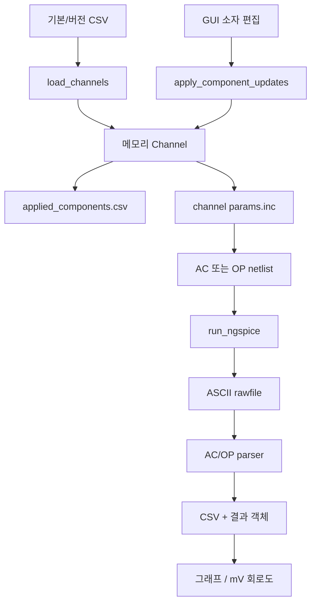
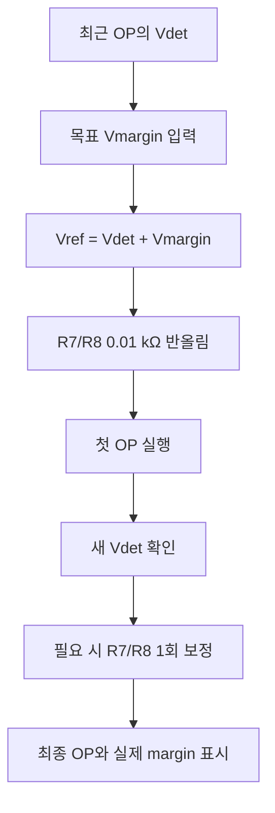
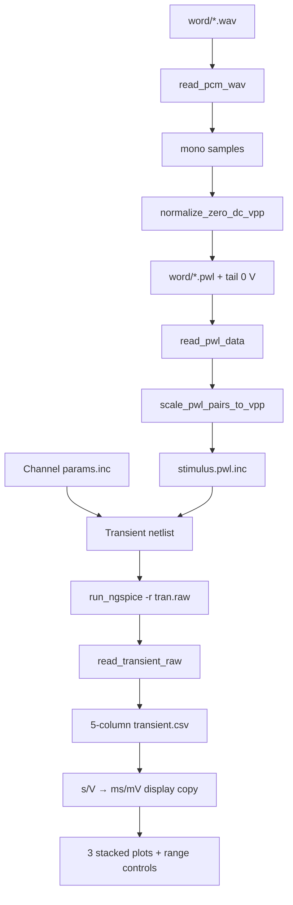

# ngspice 16채널 도구 아키텍처와 함수 설명

## 1. 범위와 불변 조건

이 문서는 AC Sweep, DC 동작점, WAV→PWL, transient의 코드 책임과 데이터
흐름을 설명한다. 수치의 내부 기준 단위는 저항 kΩ, 커패시터 nF, 시간 s,
전압 V다. OP 회로도와 transient 그래프만 표시 직전에 각각 mV,
ms/mV로 변환하며 rawfile과 CSV는 SI 단위를 유지한다.

다음 조건은 코드와 회귀검사로 유지한다.

1. `channel_components.csv`는 출고 기준값이며 쓰기를 거부한다.
2. 편집은 frozen `Channel`의 새 사본을 만들고, 기본 객체를 직접 변경하지 않는다.
3. 버전 저장은 timestamp가 붙은 새 CSV만 만든다.
4. 모든 시뮬레이션은 실제 사용한 값을 `applied_components.csv`에 기록한다.
5. AC, OP, transient는 서로 다른 netlist/raw/log 파일을 사용한다.
6. transient 입력 교체는 transient netlist에만 적용하고 AC/OP 원본은 보존한다.
7. 실행 완료나 실패가 사용자가 보고 있던 상위/AC 결과 탭을 바꾸지 않는다.
8. 상위 Notebook은 DC→AC→Transient→WAV/PWL 순서이며 DC가 초기 탭이다.
9. Transient plot의 단위 변환은 display copy에만 적용하고 원 rows를 바꾸지 않는다.
10. AC/Transient 자동 Y범위는 데이터 최소–최대가 축 높이의 90%를 차지한다.
11. \(Vmargin=Vref-Vdet\) 편집으로 Vref를 정하고 R7/R8을 각각
    0.01 kΩ로 반올림하며, 합계를 정확히 1 MΩ로 강제하지 않는다.
12. 모든 저항은 0.01 kΩ 정밀도로 계산·표시하고, R4/R5 변경은 R6 병렬값을
    제안하지만 이후의 독립 R6 편집을 허용한다.
13. Transient X와 각 Y축은 자동/수동 상태를 독립 보관하고 PWL·채널·소자값
    변경 및 재실행 뒤에도 수동값을 유지한다.
14. 일반 그래프 커서는 버튼으로만 선 추종을 활성화하며, 클릭한 여러 위치를
    고정할 수 있다.
15. `Venv_out > Vref` 음영과 구간 후처리는 생성하지 않는다.
16. Transient 결과는 PWL과 16채널 선택을 분리하며 완료된 채널만 활성화한다.

## 2. 파일별 책임

| 파일 | 책임 |
| --- | --- |
| `ngspice_channel_sweeper.py` | 소자 CSV, AC/OP/transient netlist, raw 파서, 계산, 실행 순서, Tk GUI |
| `wav_pwl.py` | PCM WAV 디코딩, mono 변환, 0 V DC/10 mVpp 정규화, PWL/manifest |
| `ngspice_runner.py` | 실행 파일 탐색, `-b/-o/-r`, 취소, stdout/stderr와 진단 로그 |
| `channel_components.csv` | 변경하지 않는 16채널 기본 소자값 |
| `component_versions/*.csv` | 사용자가 저장한 전체 16채널 소자 버전 |
| `netlist_template.cir` | 공통 토폴로지, 모델 include, 기존 입력 전압원 |
| `circuit_template.png` | OP 노드 전압/소자값 overlay의 배경 |
| `tests/test_core.py` | 수치, 파일 보호, netlist, raw parser, UI 불변조건 회귀검사 |
| `tests/fake_ngspice.py` | transient process→raw→CSV 통합 경로용 test double |

## 3. 핵심 데이터 객체

### `Channel`

CSV 한 행을 검증한 불변 객체다. `spice_parameters()`는 GUI 단위의 값을
`12.34k`, `7.59n` 같은 ngspice 표기로 바꾼다.

### `SweepSettings`

AC points/decade, 시작/정지 주파수, 출력 노드와 PSpice/KiCad 호환 설정을
보관한다. OP만 실행할 때는 AC 숫자를 읽지 않는다.

### `TransientSettings`

다음을 AC 설정과 분리해 보관한다.

- output step
- stop time 또는 `None`
- maximum step
- 실행 시 적용할 input PWL Vpp
- Vin, Vfilt, Venv, Vref node
- PSpice/KiCad 호환 설정

`resolved_stop_time()`은 사용자가 stop time을 입력했으면 그 값을 사용하고,
빈칸이면 PWL의 마지막 0 V 점을 사용한다.

### `AnalysisJobSpec` / `AnalysisJob`

AC/OP의 netlist, rawfile, 로그 이름을 정적 규격과 실제 경로로 분리한다.
Transient도 같은 `run_ngspice()` 계약을 사용하지만, stimulus/channel의
2중 반복과 PWL include가 필요하므로 `TransientSimulator`가 전용 순서를
관리한다.

### 결과 객체

| 객체 | 내용 |
| --- | --- |
| `RawPlot` | ASCII rawfile의 plot명, flags, 변수명, 복소 sample |
| `AcMetrics` | f0, peak gain, fL/fH, Q, 상태 |
| `ChannelResult` | 한 채널의 AC rows, OP node, 경로, 로그, AC metric |
| `TransientResult` | 한 stimulus/channel의 5열 analog time data, 경로, 로그 |
| `PwlConversionResult` | WAV/PWL 경로, PCM 정보, 입력/출력 통계, 상태 |

## 4. 전체 데이터 흐름

### AC / OP



### DC Vmargin 편집과 1회 재보정



양의 Vmargin은 DC detector 출력과 그보다 높은 비교기 임계값 사이의
headroom이며, 목표 입력은 0보다 커야 한다. detector 관련 소자 변경으로
Vdet가 달라질 수 있으므로 첫 OP의 새 Vdet를 사용한 보정은 한 번만 허용하고,
두 번째 결과를 최종 상태로 삼는다.

### WAV → PWL → Transient



### Transient 표시 상태

| 상태 | 생성/갱신 위치 | 소비 위치 | 재실행·채널 변경 |
| --- | --- | --- | --- |
| SI 원본 rows | `read_transient_raw()` | CSV 저장, 표시 단위 변환 | 결과 객체별 불변 |
| 자동 X/Y 범위 | `_render_transient_result()` | Matplotlib axes | 새 결과마다 재계산 |
| 수동 X 범위 | `_apply_transient_x_range()` | 세 axes의 shared X | 유지 |
| 그래프별 수동 Y | `_apply_transient_y_range()` | 선택한 axes | 유지 |
| 커서 preview | `InteractivePlotCursor._on_motion()` | armed axes | 클릭/취소 때 제거 |
| 고정 커서 | `InteractivePlotCursor._show()` | 현재 canvas | 그래프 재생성 때 제거 |

이 표에서 원본 계산 데이터와 GUI 표시 상태를 분리했다. 따라서 채널을 바꿀 때
새 raw 결과와 자동 범위는 바뀌지만, 사용자가 비교 목적으로 고른 수동 범위는
같은 단위의 GUI 상태로 남는다.

## 5. WAV 정규화 원리

원 mono sample을 \(x[n]\)이라 할 때:

\[
\bar{x}=\frac{1}{N}\sum_{n=0}^{N-1}x[n]
\]

\[
y[n]=(x[n]-\bar{x})
\frac{V_{\mathrm{pp,target}}}{x_{\max}-x_{\min}}
\]

첫 식은 discrete sample 평균, 즉 DC 성분을 구한다. 이를 뺀 뒤 두 번째
비율을 곱하면 파형 모양을 유지하면서 출력 span이 정확히 target Vpp가 된다.
현재 \(V_{\mathrm{pp,target}}=0.010\) V다.

\[
\max(y)-\min(y)
=(x_{\max}-x_{\min})
\frac{0.010}{x_{\max}-x_{\min}}
=0.010\ \mathrm{V}
\]

부동소수점 합 오차는 마지막으로 아주 작은 residual mean을 한 번 더 빼서
제거한다. 상수 파일은 분모가 0이므로 물리적으로 10 mVpp 정규화가 불가능하다.
이 경우 0 V를 출력하고 status를 `constant/silence`로 기록한다.

원 sample 시각은 \(n/f_s\)다. 마지막 원 sample은 \((N-1)/f_s\)이고,
추가 tail은 \(N/f_s\)에서 0 V다. PWL source는 마지막 값을 유지하므로
이후 transient 시간에는 0 V가 계속 적용된다.

## 6. Transient netlist 구성

`find_input_voltage_source()`는 공통 netlist에서 `/vin`에 연결된 첫 independent
voltage source를 찾는다. 따라서 source 이름을 `V4`로 고정하지 않고 `Vsin`
같은 이름도 지원한다. 양단 node 순서를 그대로 보존해 waveform 부호도 기존
source와 같다.

`remove_input_voltage_source()`는 그 source 문장과 이어지는 `+` continuation을
transient 사본에서만 제거한다. `make_pwl_source_include()`는 다음 형태의
별도 include를 만든다.

```spice
Vsin /vin bias PWL(0 0
+ 0.0000625 1.23m
+ ...
+ 1 0)
```

`make_transient_netlist()`는 channel parameter include와 stimulus include를
삽입하고 다음 지시문을 추가한다.

```spice
.save v(/vin) v(/v_filt_out) v(/v_detect_out) v(/v_ref)
.tran TSTEP TSTOP 0 TMAX
```

`.tran`은 먼저 DC 해를 구한 뒤 시간 의존 source를 적용한다. PWL 자체는
0 V DC지만 `/vin`의 음단에 기존 V3 0.9 V bias가 있으므로 절대 Vin은
약 0.9 V를 중심으로 변한다. PWL source 문장에 별도의 `DC`와 `PWL`을
동시에 넣지 않아 OP 입력과 transient 입력의 의미가 섞이지 않는다.

### 6.1 tstep/tmax 기본값

[ngspice 공식 정의] `.tran tstep tstop <tstart <tmax>>`에서 `tstep`은
출력/plotting 간격이며 post-processor에서는 제안 계산 간격이고, `tmax`는
solver의 최대 time step이다. `tmax`를 생략하면 ngspice는 `tstep`과
\((tstop-tstart)/50\) 중 작은 값을 선택한다.

[설계 기준/추론] 파형 한 주기에 최소 \(N=20\)점을 두는 기준을 쓰면

\[
t_\max\le\frac{1}{Nf_\max}
\]

이다. 최고 channel 6.761 kHz에서 7.40 µs, 16 kHz speech의 Nyquist
8 kHz에서 6.25 µs이므로 기본 `tmax=5 µs`를 선택했다. `tstep=10 µs`는
1초당 명목 100,000간격으로 데이터량과 표시 해상도를 절충한 값이다.
`parse_time_seconds()`가 `1e-5`, `10u`, `10us`, `2.5ms`를 SI 초로 바꾸며
GUI 기본 문자열은 지수 부호 오독을 피하려고 `10u`/`5u`로 표시한다.

## 7. 실행 시 PWL Vpp와 Transient 표시

`read_pwl_data()`가 읽은 원본 전압의 peak-to-peak를
\(V_{\mathrm{pp,src}}\), GUI 입력을 \(V_{\mathrm{pp,target}}\)이라 하면
`scale_pwl_pairs_to_vpp()`는 다음 비율을 모든 전압에 곱한다.

\[
k=\frac{V_{\mathrm{pp,target}}}{V_{\mathrm{pp,src}}},\qquad
v'_\mathrm{pwl}(t)=k\,v_\mathrm{pwl}(t)
\]

곱셈만 사용하므로 zero-DC 파형의 평균, 상대 파형, 마지막 0 V tail은
보존된다. 원 `.pwl` 파일은 쓰지 않고 stimulus include에만 스케일된 값을
기록한다. 상수/무음 PWL은 \(V_{\mathrm{pp,src}}=0\)이므로 새 신호를
발명하지 않고 계속 0 V로 둔다.

`read_transient_raw()`는 각 raw point를
`(time, vin, vfilt, venv, vref)`로 바꾸며 `transient.csv`도 이 다섯 열만
저장한다. `Venv_out > Vref` 구간 계산, 음영, interval CSV는 사용하지 않는다.

자동 Y범위는 유효 데이터 최소·최대를 \(d_\min,d_\max\), 목표 점유율을
\(p=0.90\)이라 할 때 다음 축 span을 사용한다.

\[
S_\mathrm{axis}=\frac{d_\max-d_\min}{p}
\]

남는 \(S_\mathrm{axis}-(d_\max-d_\min)\)을 위·아래에 절반씩 배분하므로
데이터 구간이 축 높이의 정확히 90%를 차지한다. 로그축은 같은 계산을
\(\log_{10}\) 공간에서 수행한다. 수동 X범위와 그래프별 Y범위는 GUI
상태에 따로 보관하고 새 raw 결과를 그릴 때 다시 적용한다.

## 8. 주요 함수 설명: `wav_pwl.py`

| 함수 | 역할 |
| --- | --- |
| `_decode_pcm_sample()` | 8/16/24/32-bit little-endian integer PCM 한 sample 해석 |
| `read_pcm_wav()` | WAV header 검증, 압축 거부, 다채널 frame 평균 mono 생성 |
| `normalize_zero_dc_vpp()` | 평균 제거와 min/max span scaling, 상수 파일 처리 |
| `write_pwl_data()` | time/voltage 두 열과 마지막 0 V tail을 임시파일→replace 방식으로 기록 |
| `read_pwl_data()` | 주석 무시, 두 숫자 열과 strictly increasing time 검증 |
| `discover_wav_files()` | WAV 재귀 검색, 입력 안의 output tree 제외 |
| `discover_pwl_files()` | 변환 PWL 재귀 검색과 결정적 정렬 |
| `_output_relative_path()` | 단어 폴더 구조 보존, 단어 폴더 자체를 선택한 경우 이름 보완 |
| `convert_one_wav()` | 한 WAV의 decode→normalize→write→통계 객체 |
| `write_conversion_manifest()` | Excel 호환 UTF-8 BOM manifest 작성 |
| `convert_wav_tree()` | 전체 dataset subtree 변환과 progress callback |

## 9. 주요 함수 설명: 소자와 AC/OP

네트리스트에서 R7은 1.8 V와 `/v_ref` 사이, R8은 `/v_ref`와 GND 사이에
연결된다. 따라서 `divider_vref_v()`는
\(V_\mathrm{ref}=1.8R8/(R7+R8)\)를 사용한다.
`vref_from_margin_v()`는 \(V_\mathrm{ref}=V_\mathrm{det}+V_\mathrm{margin}\)
을 적용한다. `divider_resistors_for_vref()`는 기존 합계를 명목 임피던스
규모로만 사용해 이상적인 비율을 만든 뒤 R7/R8을 각각 0.01 kΩ로 독립
반올림하므로 합계를 재보정하지 않는다. 모든 저항 입력은
`round_resistance_kohm()`에서 0.01 kΩ로 통일한다. R4/R5가 바뀔 때
`parallel_resistance_kohm()`이 \(R4R5/(R4+R5)\)를 계산해 R6 칸에
제안하며, R6 자체에는 연동 callback을 두지 않아 이후 독립 편집을 허용한다.
DC raw에서 `voltage_margin_v()`는
\(V_\mathrm{ref}-V_\mathrm{det}\)의 부호를 보존한다.

| 함수 | 역할 |
| --- | --- |
| `normalize_analyses()` | `ac/op/both`, 과거 `dc` 별칭 정규화 |
| `divider_vref_v()` | R7-top/R8-bottom 분압의 Vref 계산 |
| `vref_from_margin_v()` | Vdet와 목표 Vmargin으로 Vref 역산 및 rail 검증 |
| `round_resistance_kohm()` | 모든 저항을 Decimal half-up 방식으로 0.01 kΩ 반올림 |
| `format_resistance_kohm()` | 저항을 항상 소수점 둘째자리 문자열로 표시 |
| `parallel_resistance_kohm()` | R4/R5 병렬값을 계산해 0.01 kΩ로 반올림 |
| `divider_resistors_for_vref()` | Vref 비율을 0.01 kΩ R7/R8로 독립 반올림 |
| `voltage_margin_v()` | \(V_\mathrm{ref}-V_\mathrm{det}\) 계산 |
| `load_channels()` | CSV 필수 열, channel 중복, finite 값, Vref 분압 검증 |
| `channel_to_csv_row()` | `Channel`을 표준 CSV schema로 역변환 |
| `write_channels_csv()` | 기본 CSV target 거부, 새 snapshot exclusive-create |
| `save_component_version()` | 충돌 없는 timestamp 버전 저장 |
| `apply_component_updates()` | 양수 R/C 검증, Vmargin→Vref→R7/R8 경로 적용 |
| `make_parameter_include()` | 10개 R/C `.param` 문장 생성 |
| `strip_generated_sections()` | 기존 analysis/control/중복 param 제거 |
| `analysis_directives()` | AC 또는 OP 전용 `.save`와 analysis 지시문 |
| `make_analysis_netlist()` | 공통 회로+channel include+한 종류 analysis 결합 |
| `build_analysis_jobs()` | AC/OP별 netlist/raw/log 경로 분리 |
| `read_ascii_rawfile()` | ASCII raw header, 변수 수, point 수, real/complex 파싱 |
| `read_ac_raw()` | complex voltage를 Hz/dB/degree로 변환 |
| `calculate_ac_metrics()` | log-f peak, −3.0103 dB crossings, Q 계산 |
| `read_op_raw()` | OP 한 point의 모든 voltage vector 추출 |
| `write_normalized_csv()` | 공통 UTF-8 결과 CSV writer |
| `write_ac_metrics_summary()` | 세션 AC metric 통합 |

## 10. 주요 함수 설명: Transient

| 함수/메서드 | 역할 |
| --- | --- |
| `find_input_voltage_source()` | `/vin` 연결 source 이름과 두 terminal 탐색 |
| `remove_input_voltage_source()` | transient 사본에서 기존 source/continuation 제거 |
| `make_pwl_source_include()` | source name/극성을 보존한 continued PWL 문장 생성 |
| `transient_directives()` | 네 analog node `.save`와 `.tran` 생성 |
| `make_transient_netlist()` | params/PWL include 및 transient 지시문 결합 |
| `parse_time_seconds()` | 과학표기/10u/5ms 같은 시간 입력을 SI 초로 변환 |
| `scale_pwl_pairs_to_vpp()` | 원본을 수정하지 않고 실행용 PWL Vpp 스케일 |
| `read_transient_raw()` | time과 네 node를 5열 rows로 변환 |
| `transient_rows_to_ms_mv()` | 원 rows를 바꾸지 않고 plot용 ms/mV series 생성 |
| `data_occupancy_limits()` | linear/log 데이터가 축의 90%를 차지하는 자동범위 계산 |
| `recommended_maximum_step_s()` | \(1/(Nf_\max)\) 기준 tmax 상한 계산 |
| `TransientSimulator.stop()` | stop event와 현재 child process terminate |
| `TransientSimulator.run()` | stimulus×channel loop, include/netlist, ngspice, CSV, 결과 객체 |

`TransientSimulator.run()`의 출력 폴더는 stimulus와 channel 두 단계로 나눈다.
동일 PWL source include는 한 stimulus 안의 채널들이 공유하고, channel parameter
include와 rawfile은 각 channel 폴더에 둔다. 이 구조는 큰 PWL text를 채널마다
다시 생성하지 않으면서도 channel별 결과를 격리한다.

## 11. `ngspice_runner.py`

| 함수/자료형 | 역할 |
| --- | --- |
| `LaunchResult` | 실행 파일, 명령, cwd, return code, log/raw 경로 |
| `_timestamp()` | timezone 포함 진단 시각 |
| `append_log()` | append 후 flush/fsync |
| `command_text()` | Windows/POSIX 진단용 명령 문자열 |
| `_prefer_console()` | `ngspice.exe` 옆 `ngspice_con.exe` 우선 |
| `resolve_ngspice()` | 명시 경로, 환경변수, PATH, 일반 설치경로 탐색 |
| `run_ngspice()` | `-b -o -r`, direct-to-file stdout, 취소, 종료 진단 |
| `probe_ngspice()` | `-v` 실행 가능성 진단 |

rawfile argument는 channel cwd 기준 basename으로 전달해 Windows absolute path
인용 문제를 피한다. ngspice stdout/stderr는 PIPE에 쌓지 않고 launcher log로
직접 보내므로 긴 transient 출력이 pipe buffer를 채우지 않는다.

## 12. GUI 메서드 그룹

| 그룹 | 메서드와 책임 |
| --- | --- |
| 공통 생성 | `__init__`, `_build`, `_build_dc_tab`, `_build_ac_tab`: 상태와 네 상위 탭 |
| 공통 파일 | `_build_file_settings`, browse 메서드: 두 해석 탭의 동일 경로 변수 |
| 소자 버전 | `_browse_table`, `_reset_component_defaults`, `_save_component_version_from_gui`, `_reload_channels` |
| 소자 편집 | `_preview_r6_from_r4_r5`, `_preview_vref_from_resistors`, `_preview_resistors_from_margin`, `_commit_component_editor`, `_prepare_margin_retune` |
| DC/AC 실행 | `_settings`, `_start_run`, `_stop_run`, `_finish_controls` |
| 이벤트 | `_poll_events`: 모든 worker event를 Tk main thread에서 처리 |
| DC/AC 결과 | `_render_results`, `_refresh_*`, `_render_magnitude`, `_render_phase`, `_render_operating_point` |
| AC metric | `_build_metrics_table`, `_toggle_metric_table_row`, `_sync_metric_selection`, `_copy_metric_rows` |
| OP 조작 | pan/zoom, OP 세부 탭·pane·scroll 상태 저장/복원, `_draw_operating_point_schematic`, `_build_op_detail_tables` |
| WAV 변환 | `_build_converter_tab`, browse/scan/start/stop/finish 메서드 |
| Transient 선택 | `_build_transient_tab`, folder refresh, 실행 file/channel select, PWL 결과 dropdown, 완료된 16채널 option |
| Transient 실행 | `_transient_settings`, `_start_transient_run`, `_stop_transient_run`, `_finish_transient_controls` |
| Transient 표시 | `_build_transient_range_controls`, `_render_transient_result`, `_embed_multi_axes_figure`, 탭 복귀 시 canvas redraw |
| Transient 범위 | `_apply_transient_x_range`, `_apply_transient_y_range`, 축별 mode, `_sync_transient_range_fields` |
| 소자 상태 | `_refresh_transient_component_state`: 미커밋 편집, 기본값 대비 변경 채널, 표시 결과의 stale/current 판정 |
| 커서 | 버튼식 선 추종·다중 고정 `InteractivePlotCursor`, AC f0용 `MetricSelectionOverlay`, 재생성 전 callback 해제 |

AC/OP와 transient worker는 동시에 시작할 수 없다. worker thread는 파일과
process 작업만 수행하고 Tk widget을 직접 만지지 않는다. queue event를
`_poll_events()`가 main thread에서 처리한다.

`InteractivePlotCursor`는 평상시 motion event를 즉시 무시한다. `커서 추가`
뒤에는 정렬된 X 데이터에서 이진 탐색한 주변 점만 display 좌표로 비교해 가장
가까운 선을 고르고, animated 세로선·점·주석만 blitting한다. 클릭하면 이를
일반 고정 artist로 바꾸며, 그래프 재생성 전 `dispose()`로 event callback을
해제해 이전 canvas가 참조로 남는 문제를 막는다.

## 13. 결과 탭 상태

상위 Notebook은 DC→AC→Transient→WAV/PWL 순서로 등록하고 DC를 한 번만
초기 선택한다. 이후 worker 완료 코드에서는 상위 Notebook을 선택하지 않는다.
AC 내부 Notebook은 Magnitude→Phase→Log 순서이며 `_render_results()`가
redraw 전 tab id를 저장하고 같은 id를 복원한다.

DC와 AC 결과는 `last_op_results`, `last_ac_results`로 분리한다. DC만 다시
실행하면 OP frame만, AC만 다시 실행하면 Magnitude/Phase frame만 갱신한다.
따라서 다른 해석 결과와 사용자가 보고 있는 탭을 건드리지 않는다. OP channel
변경과 schematic zoom은 OP frame만 다시 그린다. 오류가 나도 log 탭을 자동
선택하지 않고 popup과 log 내용만 갱신한다.

OP frame은 갱신 전에 오른쪽 세부 Notebook의 선택 탭, 수평 Panedwindow의
sash 비율, schematic canvas의 x/y scroll fraction을 저장하고 재생성 뒤
복원한다. `변경값 적용 + DC 실행`은 비동기 실행을 시작하기 전에 이 상태를
`op_pending_view_state`에 동결하므로 Vmargin 보정으로 OP가 두 번 실행되어도
중간 widget event가 상태를 덮어쓰지 못한다. 세부 Notebook callback도
event를 발생시킨 현재 Notebook만 인정한다. root geometry는 초기 생성 이후
다시 설정하지 않는다. Transient
상위 탭으로 복귀할 때는 저장된 결과를 재렌더링하지 않고 기존 Matplotlib
canvas에 `draw_idle()`만 요청하므로 결과 선택과 수동 X/Y 범위가 유지된다.

AC 수동 범위는 `StringVar`에 남아 있어 OP 실행으로 지워지지 않는다.
Transient는 수동 X범위, 그래프별 Y범위, X mode, 그래프별 Y mode를 별도
tuple/dict 상태로 보관한다. 새 결과 renderer는 채널마다 기본 자동범위를
다시 계산하되 해당 축이 수동 mode일 때만 저장된 수동값을 우선 적용한다.
PWL dropdown 변경과 완료 채널 클릭도 같은 renderer를 사용하므로 범위 상태를
초기화하지 않는다.

Transient 범위 조절부는 X와 Y를 한 행에 배치하고 상태만 다음 한 줄에 둔다.
공유 X축이 동시에 보내는 여러 limit-change callback은 idle callback 하나로
합쳐 entry 갱신 중복을 줄인다.

## 14. V2 표시

V2는 다음 floating source다.

```spice
V2 1.8V 0.9V DC 0.9
```

source의 정의는 \(V(1.8V)-V(0.9V)=0.9V\)다. V1이 0.9 V rail을 만들므로
V2 양단은 1.8 V가 된다. 이전 `(0.9 V → 1.8 V)`는 이 node 관계를 설명한
GUI 문자열이었고 SPICE model이 아니다. netlist element는 유지하되 GUI
고정 소자 표시는 `DC 0.9 V`로 단순화했다.

## 15. 오류 경계와 검증

- GUI 숫자/경로/선택 오류는 process 시작 전에 거부한다.
- 기본 CSV target write는 `PermissionError`다.
- PWL time은 0 이상, strictly increasing이어야 한다.
- WAV 압축, 지원하지 않는 PCM width, 깨진 frame 길이를 거부한다.
- ngspice return code가 0이어도 rawfile이 없으면 실패다.
- raw variable/point 수와 실제 data가 다르면 파싱을 중단한다.
- 목표 Vmargin이 0 이하이거나 \(Vdet+Vmargin\)으로 계산한 Vref가
  0~1.8 V 밖이면 거부한다.
- 0.01 kΩ 반올림 뒤 어떤 저항이라도 0 이하이면 거부한다.
- 입력 PWL Vpp는 0보다 큰 finite mVpp 값만 허용한다.
- Transient X/Y 입력은 finite이며 min < max일 때만 적용한다.
- 마우스 구간 선택기는 사용하지 않고 숫자 X범위를 sharex 세 축에 적용한다.
- f0가 경계에 있거나 −3 dB crossings가 없으면 Q를 만들지 않는다.
- 각 함수와 class에는 역할 docstring이 있으며 AST 검사로 누락 0개를 확인한다.
- `python -m unittest discover -s tests -v`가 WAV/PWL, AC/OP, transient와
  fake process 경로를 검사한다.

실제 OPA379/LPV7215/BAT54W 모델의 수렴, 긴 transient 시간과 메모리 사용,
설정한 입력 Vpp가 회로 출력에 미치는 영향은 Windows ngspice에서 별도로
확인해야 한다.

## 16. 코드 점검 결과와 남은 개선점

이번 점검에서 사용되지 않던 과거 호환 상수/alias, 자동범위 wrapper,
호출되지 않는 범위 일괄 메서드, 아무 동작도 하지 않는 view-history 메서드,
사용되지 않는 결과-tab 강제선택 인수를 제거했다. R7/R8 반올림 결과의 합계를
다음 계산 기준으로 다시 쓰면 반복 편집 때 0.01 kΩ씩 기준값이 움직일 수 있어,
GUI가 보관한 명목 합계를 명시적으로 전달하도록 수정했다. 그래프 교체 전
cursor callback을 해제하고 shared-axis entry 갱신을 합쳐 불필요한 참조와
중복 작업도 줄였다. 정적 검사에서 production import 미사용 0개,
함수/class docstring 누락 0개이며 이를 회귀검사로 고정한다.

남은 구조적 개선점은 `ngspice_channel_sweeper.py`가 계산·실행·GUI를 모두
담은 큰 모듈이라는 점이다. 다음 대규모 기능 추가 전에 `core`,
`simulation`, `gui_dc`, `gui_ac`, `gui_transient`로 분리하면 변경 영향과
테스트 범위를 더 명확히 할 수 있다. 다만 이번 UI 수정과 동시에 파일을
대규모 분리하면 Windows Tk/ngspice 경로의 회귀 위험이 커지므로 이번
버전에서는 동작 변경이 필요한 부분만 정리했다.

## 17. 후속 확장

향후 10 ms feature frame은 `transient.csv`의 time 축을 기준으로 만들 수 있다.
16채널 feature vector는 같은 stimulus 아래 channel 결과를 time window로
정렬하면 된다. detector G/τ/offset sweep은 `TransientSettings`와 별도
post-processing/settings 객체를 추가하고 `run_ngspice()` 계약을 재사용한다.
이 확장은 WAV 정규화, 기본 CSV 보호, AC/OP UI와 독립적으로 진행할 수 있다.
