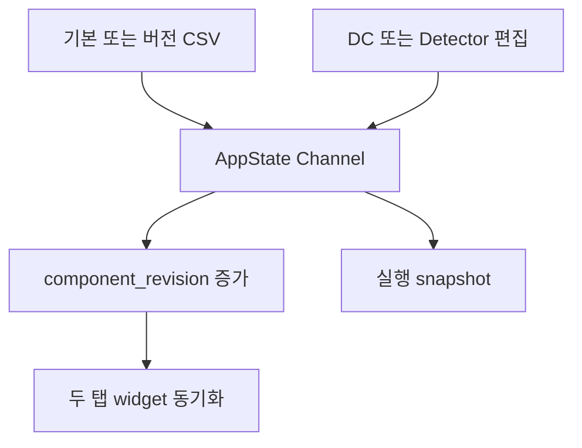
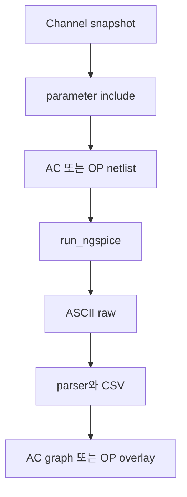
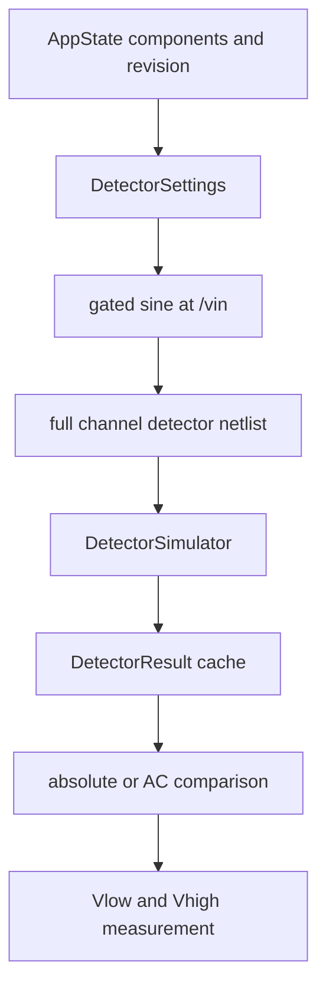
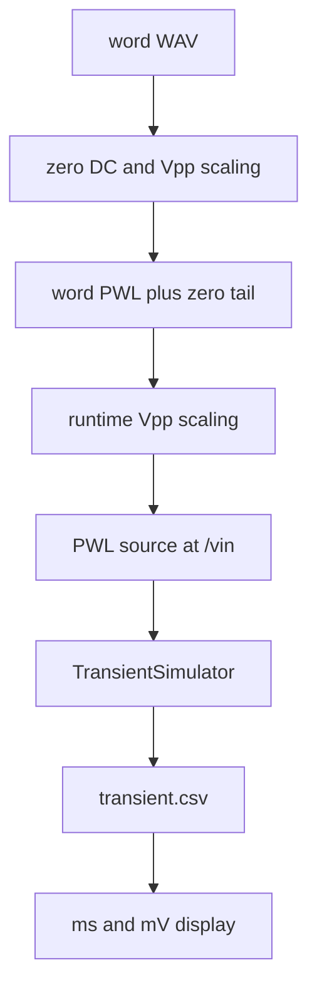

# ngspice 16채널 도구 아키텍처

## 1. 범위와 불변 조건

이 문서는 DC 동작점, AC 시뮬, Active Detector, PWL 기반 Transient,
WAV to PWL의 코드 책임과 데이터 흐름을 설명합니다.

다음 조건은 구현과 회귀검사에서 유지합니다.

1. 기존 공개 import와 `SweeperGUI` 공개 메서드를 유지합니다.
2. `channel_components.csv`는 쓰지 않습니다.
3. 소자 편집은 AppState의 immutable Channel을 새 객체로 교체합니다.
4. 유효한 사용자 편집 한 번에 `component_revision`은 한 번만 증가합니다.
5. 값 동기화 callback은 사용자 편집으로 취급하지 않습니다.
6. AC, OP, Detector, Transient는 독립 netlist, rawfile, log, CSV를 사용합니다.
7. Detector와 PWL Transient는 소자값과 revision만 공유합니다.
8. 실행 완료나 실패는 현재 상위 탭과 결과 탭을 바꾸지 않습니다.
9. 수동 축 범위와 커서는 각 workflow와 표시 모드의 소유 상태를 따릅니다.
10. 실제 모델을 쓰는 Windows ngspice 실행은 사용자 확인 뒤에만 수행합니다.

## 2. 회로 기준과 canonical net

`netlist_template.cir`과 `circuit_template.png`는 사용자가 제공한
`netlist(6).txt`와 `sch(1).pdf`를 서로 대조해 만들었습니다. canonical
전압 net은 다음 다섯 개입니다.

| 의미 | net |
| --- | --- |
| 입력 | `/vin` |
| 필터 출력 | `/v_filt` |
| envelope 출력 | `/v_env` |
| 비교기 threshold | `/v_thr` |
| 비교기 출력 | `/v_comp` |

입력 전압원 V4는 `/vin`과 `Net-_V3-Pad1_` 사이에 있습니다. Detector와
PWL Transient는 이 두 terminal과 source 이름을 그대로 보존하고 파형 정의만
바꿉니다. Filter 우회를 막기 위해 `/v_filt`에는 입력 source를 만들지
않습니다.

공통 회로에는 OPA379 filter와 active detector, BAT54WT1 diode 두 개,
LPV7215 comparator, 전원과 0.9 V bias가 그대로 남습니다. 모델 이름과 회로
연결은 generator에서 추측하거나 재구성하지 않습니다.

모델 라이브러리는 `MODEL_LIBRARY_DIR` 한 폴더에서만 가져옵니다.
`netlist_template.cir`의 고정 모델 include 세 줄과 선택형 U3 opamp의 include가
같은 폴더를 쓰므로 두 경로가 서로 다른 버전을 가리킬 수 없습니다.

## 3. 파일별 책임

| 파일 | 책임 |
| --- | --- |
| `ngspice_channel_sweeper.py` | 기존 import와 CLI를 보존하는 호환 진입점 |
| `sweeper/constants.py` | canonical net, 파일명, 기본값, C3 허용값 |
| `sweeper/models.py` | Channel, settings, result, job dataclass |
| `sweeper/components.py` | 기본 CSV 보호, 버전 저장, 공통 소자 편집 |
| `sweeper/values.py` | 단위, dB/Linear, 저항, 자동 범위 계산 |
| `sweeper/netlists.py` | AC, OP, Transient, Detector netlist 생성 |
| `sweeper/results.py` | raw parser, AC metric, Detector 측정, CSV |
| `sweeper/simulation.py` | AC/OP, Transient, Detector runner와 취소 |
| `sweeper/gui/state.py` | AppState, revision, cache, 수동 범위 |
| `sweeper/gui/base.py` | controller 위임과 공개 메서드 연결 |
| `sweeper/gui/cursors.py` | 선 추종 다중 커서와 AC metric overlay |
| `sweeper/gui/common.py` | 공통 event, 파일 경로, 소자 동기화 |
| `sweeper/gui/dc_tab.py` | OP 회로도, Vmargin, 공통 소자 편집 |
| `sweeper/gui/ac_tab.py` | AC dB/Linear 표시와 metric |
| `sweeper/gui/detector_tab.py` | Active Detector 전용 controller |
| `sweeper/gui/transient_tab.py` | PWL Transient 전용 controller |
| `sweeper/gui/pwl_tab.py` | WAV to PWL 전용 controller |
| `sweeper/gui/app.py` | 다섯 상위 탭과 controller 조정 |
| `tests/fake_ngspice.py` | Transient와 Detector raw test double |
| `tests/test_active_detector.py` | 새 unit, Detector, 동기화 회귀검사 |

## 4. 핵심 데이터 객체

### Channel과 component_revision

`Channel`은 한 채널의 모든 simulation 소자값을 보관하는 frozen dataclass입니다.
AppState는 현재 16개 Channel과 전역 `component_revision`을 보관합니다. 한
채널을 편집하면 수정된 Channel로 목록 항목을 교체하고 revision을 한 번
증가시킵니다.

DC, Detector, Transient widget은 별도 Channel 사본을 갖지 않습니다. 한쪽
편집이 확정되면 `_record_component_change()`가 세 controller의 표시값을
AppState에서 다시 읽고, DC 회로도와 `고정 소자 / 모델` 표까지 다시 그립니다.
회로도 overlay는 실행 당시 snapshot이 아니라 현재 AppState 값을 그리므로
다른 탭에서 바꾼 opamp와 소자값이 즉시 보입니다.

Detector와 Transient의 `공유 소자값` 패널은
`CommonController._build_shared_component_editor()` 하나로 만들어지고
`_commit_shared_components()`가 검증과 revision 증가를 담당합니다. 두 탭의
필드와 동작이 구조적으로 같습니다.

`Vthr`와 `Vmargin`은 같은 분압기의 두 표현이므로
`apply_component_updates()`는 둘 중 하나만 기준으로 받습니다. 둘을 동시에
지정하면 명시적으로 거부합니다. 동기화 중에는 callback guard를 사용하므로 추가 revision이나
자동 simulation이 발생하지 않습니다.

### SweepSettings와 AC 결과

`SweepSettings`는 AC points per decade, start/stop frequency, 출력 node,
PSpice 호환 설정을 보관합니다. `ChannelResult.ac_rows`는 항상 다음 원본 형식을
사용합니다.

```text
(frequency_hz, magnitude_db, phase_deg)
```

Linear 표시는 원본 dB를 그릴 때 변환합니다. Q와 bandwidth는 dB 원본에서
계산합니다.

### TransientSettings와 TransientResult

`TransientSettings`는 PWL output step, stop time, maximum step, input Vpp,
저장 node를 보관합니다. 기존 공개 생성자 호환을 위해 `vref_node` field를
유지하며, runtime은 canonical alias인 `vthr_node`를 사용합니다.

`TransientResult.rows` 형식은 다음과 같습니다.

```text
(time_s, vin_v, v_filt_v, v_env_v, v_thr_v)
```

### DetectorSettings와 DetectorResult

`DetectorSettings`는 다음 값을 SI 단위로 보관합니다.

- frequency_hz
- input_vpp_v
- gate_on_s
- gate_duration_s
- total_time_s
- maximum_step_s
- canonical four saved nodes

`DetectorResult`는 Channel snapshot, DetectorSettings, 실행 시점의
`component_revision`, result path, 다섯 열 rows, log를 보관합니다.
`DetectorResult.is_stale()`은 현재 revision과 실행 revision을 비교합니다.

`DetectorMeasurement`는 Vlow, Vhigh, Headroom, 네 crossing time, Rise time,
Fall time, 각 방향의 성공 여부와 실패 원인을 보관합니다.

## 5. 상위 GUI 상태

상위 Notebook 순서는 다음과 같습니다.

1. DC 동작점
2. AC 시뮬
3. Active Detector
4. Transient 시뮬
5. WAV to PWL 시뮬

초기 선택은 DC입니다. worker 완료 event는 상위 Notebook의 `select()`를
호출하지 않습니다. Transient와 Detector 탭으로 돌아올 때도 기존 canvas에
redraw만 요청하며 result selection, range, cursor state를 임의 변경하지
않습니다.

## 6. 전체 데이터 흐름

### 공통 component 흐름



### AC와 OP



### Active Detector 데이터 흐름



Detector 실행은 `transient_pwl_files`, `last_transient_results`, Transient
result lookup, Transient manual ranges, Transient cursor에 쓰지 않습니다.
Detector cache는 channel number별 `DetectorResult`를 따로 보관합니다.

### WAV to PWL과 Transient



## 7. AC Magnitude unit 처리

내부 AC magnitude는 dB입니다. 변환 함수는 다음 식을 그대로 구현합니다.

```text
Glinear = 10 to the power of (GdB divided by 20)
GdB = 20 times log base 10 of Glinear
```

`db_to_linear()`는 -20 dB 아래를 clip하지 않습니다. -40 dB는 0.01로 남고,
negative infinity만 0으로 표현합니다. `linear_to_db(0)`은 negative infinity를
반환합니다.

`AcTabController._render_magnitude()`는 X축이 Decade일 때만 log scale을
사용합니다. dB와 Linear Y축은 모두 ordinary linear scale입니다. Linear
자동 범위는 다음과 같습니다.

```text
Ymin = 0
Ymax = actual maximum * 1.05
```

AppState의 `ac_manual_y_limits`는 `dB`와 `Linear` key를 분리합니다. unit을
바꾸기 전에 현재 text를 기존 key에 저장하고, 새 key의 text를 변환 없이
복원합니다. channel 변경과 재실행은 이 dict를 초기화하지 않습니다.

AC metric은 peak, peak minus 3.0103 dB의 두 crossing, Q를 dB 원본에서
계산합니다. Linear 표시의 half power magnitude는 peak magnitude divided by
square root of 2와 같습니다. Y label, cursor, metric table, copy text는 현재
unit을 사용합니다.

## 8. Detector netlist 생성

`find_input_voltage_source()`는 `/vin`에 연결된 기존 independent voltage
source의 이름과 terminal 순서를 찾습니다. 현재 회로에서는 다음 결과입니다.

```text
V4 /vin Net-_V3-Pad1_
```

`make_gated_sine_pairs()`는 Vpp의 절반을 sine peak로 사용합니다. 한 주기의
sample interval 수를 4의 배수로 올림하므로 positive peak와 negative peak가
PWL에 포함되고 실제 peak to peak 값이 설정 Vpp와 일치합니다. Gate 이전과
Gate OFF 이후 source difference는 0 V입니다. 두 peak를 모두 포함할 수
있도록 settings validation은 Gate 지속시간을 정현파 한 주기 이상으로
제한합니다.

`make_detector_netlist()`는 원본 V4 문장만 detector 사본에서 제거하고 다음
include를 삽입합니다.

1. 기본값이 아닌 U3 opamp를 고른 경우 그 모델의 라이브러리
2. channel parameter include
3. gated sine source include

`replace_detector_opamp()`는 `XU3` 문장의 마지막 토큰인 모델 이름만 교체하고
노드 목록은 그대로 둡니다. `DETECTOR_OPAMP_CHOICES`의 세 모델이 모두
`(IN+, IN-, V+, V-, OUT)` 순서로 선언되어 있음을 라이브러리에서 확인했기
때문입니다. 필터부 `XU1`, `XU2`는 교체하지 않습니다.

나머지 전원, bias, filter, diode detector, comparator, model include는 그대로
보존합니다. Detector 지시문은 다음 네 node와 transient time을 저장합니다.

```spice
.save v(/vin) v(/v_filt) v(/v_env) v(/v_thr)
.tran maximum_step total_time 0 maximum_step
```

`DetectorSimulator`는 자체 stop event와 child process handle을 사용합니다.
실행 결과는 `detector.raw`, `detector_settings.csv`, 두 log로 분리하며
`settings.write_csv`가 참일 때만 `detector.csv`를 추가로 씁니다. 실행 settings
CSV에는 component revision도 기록합니다.

## 9. Detector 표시 변환

절대전압 모드는 result rows를 그대로 ms와 mV로 변환합니다. AC 비교 모드는
Gate ON보다 앞선 sample의 평균을 계산합니다.

```text
vin_ac = vin - vin_pre
vfilt_ac = vfilt - vfilt_pre
venv_ac = venv - venv_pre
vthr_relative = vthr - venv_pre
```

`v_thr`만 자기 baseline이 아니라 `venv_pre`를 빼므로 comparator threshold의
상대 위치가 보존됩니다. 시간 이동, amplitude normalization, phase alignment는
수행하지 않습니다.

`detector_manual_x_limits_ms`와 `detector_manual_y_limits_mv`는 `절대전압`과
`AC 비교` key를 따로 사용합니다. 표시 mode 전환 전에 현재 text를 저장하고
새 mode의 text를 복원합니다.

## 10. Headroom, Rise time, Fall time

Vlow와 Vhigh는 절대전압 V 단위로 계산하며 GUI만 mV를 사용합니다.

```text
Vheadroom = Vhigh - Vlow
Trise = Time_up_high - Time_up_low
Tfall = Time_down_low - Time_down_high
```

Vhigh가 Vlow보다 크지 않거나 두 값이 finite가 아니면 측정을 시작하지
않습니다. 첫 result에는 Gate 구간에서 관측한 `v_env` swing의 10 percent와
90 percent level을 기본값으로 제안하지만, 이후에는 사용자가 입력한 절대
level을 유지합니다.

교차 시간은 두 sample의 선분에 대한 linear interpolation으로 계산합니다.

```text
fraction = (level - y1) / (y2 - y1)
time_cross = t1 + fraction * (t2 - t1)
```

Rise는 Gate ON에서 시작해 첫 Low up crossing을 찾은 뒤 그 상태가 유효한
동안 첫 High up crossing을 찾습니다. High에 도달하기 전에 Low 아래로
돌아가면 그 시도를 버리고 다음 Low crossing부터 다시 찾습니다. Fall도 Gate
OFF 뒤 High down crossing과 Low down crossing에 같은 순서 규칙을 적용합니다.

어느 crossing도 만들지 못하면 해당 time은 `None`으로 남기고 실패 원인을
표시합니다. 계산에 사용한 crossing만 graph marker로 추가합니다. AC 비교
그래프의 level line은 Vlow와 Vhigh에서 `venv_pre`를 뺀 위치에 그리지만,
측정은 원본 절대전압 rows를 사용합니다.

## 11. R4, R5, R6, C3 동기화

Detector editor는 R4, R5, R6를 kohm으로 받습니다. R4 또는 R5의 widget value가
바뀌면 다음 값을 0.01 kohm으로 반올림해 R6 widget에 넣습니다.

```text
R6 = (R4 * R5) / (R4 + R5)
```

R6에는 reverse callback이 없으므로 R6 직접 편집이 R4나 R5를 바꾸지
않습니다. C3 combobox는 `C3_ALLOWED_NF`의 25개 값만 사용하고 state는
`readonly`입니다.

commit 순서는 다음과 같습니다.

1. widget text validation
2. 새 Channel 생성
3. AppState Channel 교체
4. `component_revision` 한 번 증가
5. DC와 Detector widget 동기화
6. 기존 result stale 상태 갱신

이 흐름에는 simulation start가 없습니다. 실행 버튼은 commit이 끝난 현재
Channel과 revision을 local snapshot으로 캡처합니다.

## 12. DC Vmargin

DC headroom 정의는 다음과 같습니다.

```text
Vmargin = Vthr - Venv_DC
```

R7은 1.8 V top leg, R8은 GND bottom leg입니다. 기존 공개 함수 이름인
`divider_vref_v()`, `divider_resistors_for_vref()`, `vref_from_margin_v()`는
호환성을 위해 유지하지만, 계산과 사용자 label은 Vthr와 Venv_DC를 사용합니다.

목표 Vmargin 편집으로 R7과 R8을 바꾼 뒤 첫 OP에서 새 `Venv_DC`를 얻으면
R7과 R8을 한 번만 다시 계산합니다. 두 번째 OP가 최종 결과이며 반복 보정으로
revision이 계속 증가하지 않습니다.

## 13. 결과 cache와 stale 판정

| 상태 | 소유자 | stale 기준 |
| --- | --- | --- |
| AC 결과 | `last_ac_results` | 기존 v14 동작 유지 |
| OP 결과 | `last_op_results` | 기존 v14 동작 유지 |
| PWL Transient 결과 | `transient_result_lookup` | result Channel과 현재 Channel 비교 |
| Detector 결과 | `detector_result_cache` | result revision과 현재 revision 비교 |

Detector channel 선택은 Detector 전용 state입니다. cache result를 바꿔 표시해도
DC channel, Transient PWL, Transient channel selection을 쓰지 않습니다.

## 14. parser와 CSV

`read_transient_raw()`와 `read_detector_raw()`는 raw variable name을 canonical
형식으로 비교해 다음 다섯 열 rows를 생성합니다.

```text
time_s, vin_v, v_filt_v, v_env_v, v_thr_v
```

raw와 CSV는 s와 V를 보존합니다. GUI renderer만 ms와 mV로 변환한 display
copy를 만듭니다. OP CSV는 모든 voltage node를 기록합니다. AC CSV는
frequency, dB magnitude, Linear magnitude, phase를 기록합니다.

### parser 구조

parser는 세 부분으로 나뉩니다.

| 함수 | 책임 |
| --- | --- |
| `_parse_raw_header()` | `Values:`까지만 읽어 변수 목록, flags, 점 수 확인 |
| `_fast_raw_points()` | 값 섹션을 1 MB 청크로 읽어 고정폭 token record로 해석 |
| `_fallback_raw_points()` | 예상과 다른 배치일 때 줄 단위로 다시 해석 |

값 섹션은 점마다 `인덱스 token + 변수 수만큼의 token`이므로 줄 단위 정규식
대신 청크당 `split()` 한 번으로 처리합니다. 점 index token이 숫자가 아니거나,
token 수가 stride로 나누어떨어지지 않거나, 점 수가 헤더와 다르면 fast path는
`None`을 반환하고 fallback이 다시 해석합니다. Fortran `D` 지수 표기가 이
fallback 경로로 처리됩니다.

`Flags: real`인 plot은 `float`, `complex`인 plot만 `complex`로 보관합니다.
Python `float`도 `.real`을 제공하므로 기존 소비자 코드는 그대로 동작하고,
transient 한 점마다 다섯 개씩 생기던 complex 객체가 사라집니다.

`read_transient_raw()`와 `read_detector_raw()`는 `RawPlot` 전체를 만들지 않고
필요한 다섯 열만 골라 한 번에 최종 rows로 쌓습니다. 80 MB / 635,355점
transient 기준으로 4.84초 420 MB에서 1.15초 143 MB가 됩니다.

### 결과 CSV 선택 생성

`TransientSettings.write_csv`와 `DetectorSettings.write_csv`가 `transient.csv`,
`detector.csv` 생성 여부를 결정합니다. 두 파일은 rawfile과 내용이 같은
중복본이므로 GUI 기본값은 생성하지 않음이고, 라이브러리 기본값은 기존 호출
호환을 위해 생성함입니다. `detector_settings.csv`, `applied_components.csv`,
AC/OP CSV는 이 설정과 무관하게 항상 생성합니다.

## 15. thread와 event 경계

AC/OP, Detector, PWL Transient worker는 동시에 시작하지 않습니다. 각 runner는
자체 stop event와 현재 child process를 갖습니다. worker thread는 Tk widget을
직접 수정하지 않고 queue에 다음 event를 넣습니다.

- AC/OP: `log`, `done`, `error`
- Detector: `detector_log`, `detector_result`, `detector_done`, `detector_error`
- Transient: `tran_log`, `tran_result`, `tran_done`, `tran_error`

`DetectorSimulator.run_channels()`는 한 세션 폴더 안에서 선택 채널을 순차
실행하며 job마다 `on_result` callback을 호출합니다. 기존 단일 채널 `run()`은
이 위에 남겨 공개 API를 유지합니다. 사용자가 중지하면 `_run_channel()`이
예외 대신 `None`을 반환하므로 정상 종료로 처리되고 오류 대화상자가 뜨지
않습니다.

`TransientSimulator.run()`은 job 하나가 parse될 때마다 `on_result` callback을
호출하고, GUI worker는 이를 `tran_result` event로 queue에 넣습니다. 따라서
남은 채널이 실행 중이어도 끝난 채널의 결과를 즉시 볼 수 있습니다.

`_install_transient_result()`는 한 결과만 등록하며 다음 규칙을 지킵니다.

1. 그 채널의 결과 버튼을 활성화합니다.
2. 그 실행에서 아직 아무것도 그리지 않았을 때만 자동으로 그립니다.
3. 이미 그린 뒤에는 사용자가 버튼을 눌러야 표시가 바뀝니다.

`transient_displayed_result`는 현재 화면에 그려진 result 객체를 보관합니다.
`_on_transient_result_channel_changed()`는 같은 객체를 다시 그리지 않으므로,
job 완료나 실행 종료가 사용자가 배치한 커서와 축 상태를 지우지 않습니다.

`CommonController._poll_events()`가 main thread에서 결과를 cache에 넣고 현재
화면만 redraw합니다. Detector 완료 경로는 Transient state에 쓰지 않습니다.

세 runner는 실행 직전에 `_reject_paths_over_windows_limit()`으로 생성될 경로가
Windows MAX_PATH를 넘지 않는지 확인합니다. Python은 긴 경로를 열 수 있지만
`ngspice_con.exe`는 열지 못하고 파일이 없다고만 보고하므로, 미리 막지 않으면
원인을 알 수 없는 실패가 됩니다. Transient의 stimulus 폴더 이름은
`_stimulus_directory_name()`이 `stim_0001_단어` 형태로 길이를 고정합니다.

세 runner의 실행 실패는 `_ngspice_failure_message()` 하나로 같은 형식의 진단
문자열을 만듭니다. ngspice는 netlist와 model 오류를 `-o` log 앞부분에
기록하므로 log 끝부분만 잘라 보면 원인을 놓칩니다. 따라서 위치와 무관하게
오류 행을 행번호와 함께 추출하고, 오류 행이 없으면 경고 행을 대신 보여준
뒤 두 log 파일 경로를 항상 덧붙입니다.

## 16. 공개 API 호환

`ngspice_channel_sweeper.py`는 얇은 호환 진입점으로 남습니다. 기존 공개
이름인 Channel, SweepSettings, TransientSettings, Simulator,
TransientSimulator, SweeperGUI, netlist 함수와 parser를 계속 import할 수
있습니다.

새 Detector 공개 이름은 다음과 같습니다.

- `DetectorSettings`
- `DetectorResult`
- `DetectorMeasurement`
- `DetectorSimulator`
- `make_detector_netlist()`
- `read_detector_raw()`

`ControllerMethod`는 `SweeperGUI._build_detector_tab`을
`sweeper/gui/detector_tab.py` 구현에 연결합니다. 기존 GUI method naming과
instance override 동작을 유지합니다.

## 17. 검증 경계

사용자 확인 전에는 다음 검증만 수행합니다.

1. AC, OP, Transient, Detector netlist 생성
2. latest canonical net parser와 CSV
3. 합성 Detector waveform과 crossing 계산
4. fake ngspice를 통한 process, raw, CSV 경로
5. GUI source와 AppState의 독립성 검사
6. 공개 import와 controller 소유권 검사
7. 기본 CSV hash 불변 검사

실제 OPA379, LPV7215, BAT54WT1 모델의 convergence, model path, 긴 transient
시간과 memory 사용은 사용자 확인 뒤 Windows ngspice에서 검사합니다.
