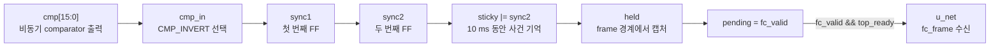
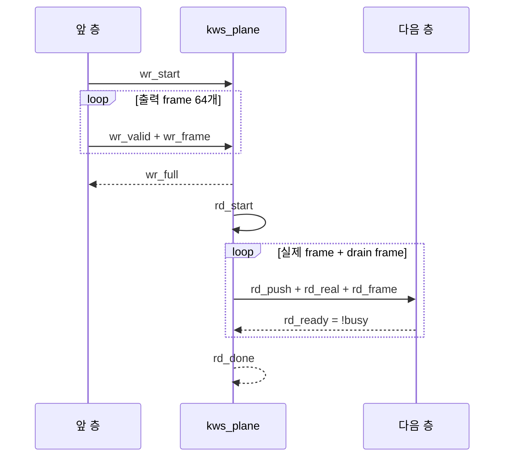
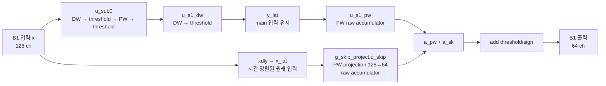
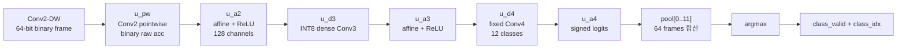

# RTL 신호 지도 — 입력 핀부터 분류 결과까지

이 문서는 XSim 파형과 Vivado schematic에서 보이는 이름을 **원래 RTL의 블록과
데이터 흐름으로 되돌려 읽기 위한 중앙 지도**다. 네트워크 수학은
[`conv_structure.md`](conv_structure.md), 합성 primitive는
[`fpga_primitives.md`](fpga_primitives.md), 실행 명령은
[`../rtl/RUNNING.md`](../rtl/RUNNING.md)에 더 자세히 적혀 있다.

가장 먼저 기억할 규칙은 세 가지다.

1. `/`는 인스턴스 안으로 한 단계 들어간다는 뜻이다.
2. `valid=1`인 사이클에만 그 옆의 데이터가 새 값으로서 의미가 있다.
3. `busy=1`인 블록에는 다음 입력을 밀어 넣지 않는다.

예를 들어 다음 경로는 B1의 residual projection 엔진을 뜻한다.

```text
/tb_board_top/dut/u_net/u_top/u_b1/g_skip_project.u_skip
  테스트벤치   보드    합성래퍼 네트워크 B1    generate scope       pointwise 엔진
```

`g_skip_project.u_skip`에 점이 들어간 것은 Verilog `generate` scope와 그 안의
인스턴스를 Vivado/XSim이 한 계층 이름처럼 표시하기 때문이다.

---

## 1. 전체를 한 장으로 보기

```mermaid
flowchart LR
    AFE["AFE 비교기 16개<br/>cmp[15:0]"]
    FC["u_fc: kws_frame_ctrl<br/>동기화 · 10 ms OR · padding"]
    C1["u_c1: Conv1<br/>16 ch × 128 → 128 ch × 64"]
    PA["u_pa: plane A<br/>128 ch × 64 frames"]
    B1["u_b1: residual B1<br/>128 → 64 ch"]
    PB["u_pb: plane B<br/>64 ch × 64 frames"]
    B2["u_b2: residual B2<br/>64 → 64 ch"]
    PC["u_pc: plane C<br/>64 ch × 64 frames"]
    B3["u_b3: residual B3<br/>64 → 64 ch"]
    PD["u_pd: plane D<br/>64 ch × 64 frames"]
    C2["u_c2: Conv2 depthwise<br/>k=29, dilation=2"]
    TL["u_tail<br/>Conv2 PW → Conv3 → Conv4<br/>pool → argmax"]
    OUT["class_idx[3:0]<br/>class_valid"]

    AFE -->|"비동기 펄스"| FC
    FC -->|"fc_valid + fc_frame[15:0]"| C1
    C1 -->|"c1_ov + c1_of[127:0]"| PA
    PA -->|"pa_push/real/frame"| B1
    B1 -->|"b1_ov + b1_of[63:0]"| PB
    PB -->|"pb_push/real/frame"| B2
    B2 -->|"b2_ov + b2_of[63:0]"| PC
    PC -->|"pc_push/real/frame"| B3
    B3 -->|"b3_ov + b3_of[63:0]"| PD
    PD -->|"pd_push/real/frame"| C2
    C2 -->|"c2_ov + c2_of[63:0]"| TL
    TL --> OUT
```



정적 전체 그림은 [`32_top_schematic.svg`](diagrams/32_top_schematic.svg)에 있다.
평면 버퍼가 필요한 이유는 [`28_plane_buffer.svg`](diagrams/28_plane_buffer.svg),
각 연산 모듈 내부는 [`25_module_internals.svg`](diagrams/25_module_internals.svg)를 본다.

### 데이터의 크기와 의미

| 경계 | 한 프레임의 폭 | 시간 프레임 수 | 값의 의미 |
|---|---:|---:|---|
| AFE → `u_fc` | 16 bit | 실제 구간 100 | comparator 채널별 0/1 이벤트 |
| `u_fc` → Conv1 | 16 bit | padding 포함 128 | bit 1=`+1`, bit 0=`-1` |
| Conv1 → plane A | 128 bit | stride 2 후 64 | threshold가 끝난 이진 활성 |
| B1 → plane B | 64 bit | 64 | 이진 활성 |
| B2/B3/Conv2-DW | 64 bit | 64 | 이진 활성 |
| tail Conv2-PW | 채널별 정수 | 64 | raw accumulator → affine/ReLU |
| Conv3 | 채널별 고정소수점 | 64 | 128개 연속 활성 |
| Conv4 | 채널별 signed logit | 64 | 12개 class 점수 |
| pool/argmax | 4 bit | clip당 1회 | class index 0..11 |

여기서 `frame`은 한 시각에 모든 채널을 가로로 묶은 packed vector다. 예를 들어
`fc_frame=16'h0004`는 세 번째 채널인 bit 2만 `+1`이라는 뜻이다.

---

## 2. 원래 MatchboxNet과 얼마나 같은가

결론부터 말하면 **큰 layer graph는 MatchboxNet-3x2x64와 매우 가깝고, 숫자를 계산하는
방법과 하드웨어 실행 순서는 FPGA에 맞게 크게 바뀌었다.** `3x2x64`는 residual block
3개, block당 TCS sub-block 2개, 몸통 폭 64채널을 뜻한다.

| 구조 요소 | MatchboxNet 골격 | 이 프로젝트 |
|---|---|---|
| 입력 앞단 | feature frame 입력 | AFE의 16채널 이진 frame |
| prologue | temporal Conv1, stride 2 | `u_c1`, k=11, 16→128, stride 2 |
| 몸통 | residual block 3개 | `u_b1`, `u_b2`, `u_b3` |
| block 내부 | TCS sub-block 2개 | 각 block에 DW→PW 두 묶음 |
| 몸통 폭 | C=64 | B1 출력부터 64채널 |
| residual | identity 또는 projection | B1 projection, B2/B3 identity |
| epilogue | temporal/separable conv + pointwise layers | Conv2-DW/PW, Conv3, Conv4 |
| head | 시간 평균 후 class 판정 | 64-frame 합산 후 argmax |

신경망 관점에서 같은 부분은 kernel을 따라 시간축을 보는 depthwise convolution, 채널을
섞는 pointwise convolution, 두 sub-block을 묶는 residual, 마지막 시간 pooling이다.

달라진 부분은 다음과 같다.

- Conv1 입력은 이미 AFE가 만든 1-bit `{-1,+1}`이며 Conv1 weight는 INT8이다.
- B1~B3와 Conv2의 이진 구간은 곱셈 대신 XNOR/popcount를 쓴다.
- 몸통의 BN+sign은 export 때 정수 threshold 비교로 접힌다.
- Conv3은 INT8, Conv4는 fixed-point로 남겨 양 끝단 정확도를 보존한다.
- hardware에는 softmax가 없다. 같은 logits에서 argmax만 필요하므로 생략한다.
- software layer를 병렬로 펼치지 않고 작은 MAC을 채널/word에 걸쳐 재사용하는 folded
  실행을 한다.
- layer 사이에는 `kws_plane`을 두고 clip의 한 단계를 끝낸 뒤 다음 단계를 실행한다.

따라서 `kws_plane`, `busy`, `push`, FSM은 MatchboxNet 수학에 새 layer를 더한 것이
아니다. 같은 layer graph를 제한된 FPGA 자원과 정확한 handshake로 실행하기 위한
하드웨어 구조다.

---

## 3. 보드와 테스트벤치 계층

```text
tb_board_top                         시뮬레이션 전용
└─ dut : kws_board_top               실제 보드 최상위
   ├─ reset/start 동기화 회로
   ├─ u_fc  : kws_frame_ctrl         비동기 비교기 → 이진 frame
   └─ u_net : kws_top_synth          export 파라미터/ROM을 묶는 합성 래퍼
      └─ u_top : kws_top             실제 KWS 데이터패스와 시퀀서
         ├─ u_c1
         ├─ u_pa → u_b1
         ├─ u_pb → u_b2
         ├─ u_pc → u_b3
         ├─ u_pd → u_c2
         └─ u_tail
```

| 계층 | 존재 위치 | 역할 |
|---|---|---|
| `tb_board_top` | XSim만 | comparator 펄스를 만들고 골든 결과와 비교 |
| `dut` | XSim의 DUT | 실제 FPGA에 합성되는 `kws_board_top` |
| `u_fc` | 보드 래퍼 안 | 비동기 AFE 신호를 동기 frame으로 변환 |
| `u_net` | 보드 래퍼 안 | 선택한 export의 폭, kernel, ROM 경로를 연결 |
| `u_top` | `u_net` 안 | Conv1부터 class 출력까지 실행 |

`requested`, `got_class`, `active_clip`, `frames_seen` 같은 이름은 테스트벤치에만 있다.
실제 bitstream에는 포함되지 않는다. 반대로 `cmp`, `class_idx`, `busy`는 실제 보드
top port이면서 테스트벤치가 연결하는 신호다.

### 인스턴스에서 소스 파일로 가는 색인

| module/instance | 소스 | 맡은 일 |
|---|---|---|
| `kws_board_top` / `dut` | [`rtl/kws_board_top.v`](../rtl/kws_board_top.v) | 실제 FPGA port와 reset/start 동기화 |
| `kws_frame_ctrl` / `u_fc` | [`rtl/kws_frame_ctrl.v`](../rtl/kws_frame_ctrl.v) | comparator 이벤트를 128개 frame으로 변환 |
| `kws_top_synth` / `u_net` | [`rtl/synth/kws_top_synth.v`](../rtl/synth/kws_top_synth.v) | export macro와 `kws_top` 파라미터 연결 |
| `kws_top` / `u_top` | [`rtl/kws_top.v`](../rtl/kws_top.v) | 전체 단계 FSM과 plane 연결 |
| `kws_plane` / `u_pa`..`u_pd` | [`rtl/kws_plane.v`](../rtl/kws_plane.v) | 층 사이 activation 저장/재생 |
| `kws_conv1` / `u_c1` | [`rtl/kws_conv1.v`](../rtl/kws_conv1.v) | 이진 입력 × INT8 weight 첫 convolution |
| `kws_block` / `u_b1`..`u_b3` | [`rtl/kws_block.v`](../rtl/kws_block.v) | TCS 두 개와 residual 합 |
| `kws_tcs_sub` / `u_sub0` | [`rtl/kws_tcs_sub.v`](../rtl/kws_tcs_sub.v) | depthwise→pointwise sub-block |
| `kws_dw_conv` / `u_dw`, `u_s1_dw`, `u_c2` | [`rtl/kws_dw_conv.v`](../rtl/kws_dw_conv.v) | 시간축 이진 convolution |
| `kws_pw_conv` / `u_pw`, `u_s1_pw`, `u_skip` | [`rtl/kws_pw_conv.v`](../rtl/kws_pw_conv.v) | 채널축 이진 convolution |
| `kws_bin_mac` / `u_mac` | [`rtl/kws_bin_mac.v`](../rtl/kws_bin_mac.v) | XNOR/popcount raw 누산기 |
| `kws_tail` / `u_tail` | [`rtl/kws_tail.v`](../rtl/kws_tail.v) | Conv2-PW부터 pooling/argmax까지 |
| `kws_dense_conv` / `u_d3`, `u_d4` | [`rtl/kws_dense_conv.v`](../rtl/kws_dense_conv.v) | INT8/fixed dense 1×1 convolution |
| `kws_affine` / `u_a2`..`u_a4` | [`rtl/kws_affine.v`](../rtl/kws_affine.v) | BN을 접은 곱셈·덧셈·시프트·ReLU |
| `tb_board_top` | [`rtl/tb/tb_board_top.v`](../rtl/tb/tb_board_top.v) | 펄스 생성과 골든 비교, 합성 제외 |

### `kws_board_top`이 필요했던 이유

`kws_top`과 `kws_top_synth`의 입력은 이미 완성된 **동기식 16-bit frame**이다. 그러나
실제 보드에 들어오는 것은 클럭과 무관하게 변하는 comparator 16가닥과 비동기
reset/start다. 두 경계는 바로 연결할 수 없다.

`kws_board_top`은 다음 보드 전용 기능을 한곳에 모은다.

1. `rst_n`은 비동기로 assert하고 두 FF를 거쳐 동기적으로 해제한다.
2. 외부 `start`를 두 FF로 동기화하고 rising edge 한 번을 `start_pulse`로 만든다.
3. `u_fc`에서 비동기 `cmp`를 동기화하고 10 ms frame으로 이산화한다.
4. 보드의 50 MHz와 모델의 10 ms를 `FRAME_CYCLES=500,000`으로 연결한다.
5. `u_fc`의 ready/valid frame을 `u_net`에 연결한다.
6. frame controller와 network의 busy를 OR하고 최종 class를 출력 register에 유지한다.
7. 합성 top에 `cmp[15:0]`를 노출해 XDC가 실제 FPGA pin 16개를 묶을 수 있게 한다.

`kws_top_synth`만 top으로 합성하면 comparator pin과 `u_fc`가 전혀 없다. 과거 schematic에
frame controller가 보이지 않았던 가장 유력한 이유도 이것이다. 보드 전체를 보려면
반드시 `-top kws_board_top`으로 합성해야 한다.

`SHFT_OE`처럼 보드의 level shifter를 FPGA가 제어하게 된다면 그 port와 안전한 reset
값을 추가할 장소도 `kws_board_top`이다. 현재 RTL top에는 `SHFT_OE` port가 아직 없다.

---

## 4. AFE 입력이 `fc_frame`이 되는 과정



| 신호 | 누가 만드나 | 어디로 가나 | 의미 |
|---|---|---|---|
| `cmp[15:0]` | AFE comparator 또는 TB | `u_fc` | 클럭과 무관한 비동기 펄스 |
| `cmp_in` | `u_fc` | `sync1` | `CMP_INVERT`가 1이면 반전된 입력 |
| `sync1` | 첫 번째 synchronizer FF | `sync2` | metastability가 남을 수 있는 중간값 |
| `sync2` | 두 번째 synchronizer FF | `sticky` | 내부 로직이 사용해도 되는 동기 신호 |
| `sticky` | 매 클럭 OR 누산 | `held` | 현재 10 ms window에서 한 번이라도 1이었는지 |
| `frame_edge` | frame counter | `sticky`, `held` | 한 10 ms window가 닫히는 순간 |
| `held` | `u_fc` | `out_frame=fc_frame` | 소비될 때까지 고정되는 완성 frame |
| `pending` | `u_fc` | `out_valid=fc_valid` | 아직 네트워크가 받지 않은 frame 존재 |
| `top_ready` | `u_net/u_top` | `u_fc.out_ready` | Conv1이 지금 frame을 받을 수 있음 |
| `take` | `u_fc` | 내부 counter/FSM | `fc_valid && top_ready`, 실제 전달 사건 |

`sticky`가 바로 이 프로젝트의 `max` 이산화다. 10 ms 동안 comparator가 여러 번
펄스를 내도 결과는 1 하나이며, 한 번도 안 내면 0이다.

`u_fc`의 상태값은 다음과 같다.

| `u_fc/st` | 값 | 동작 |
|---|---:|---|
| `S_IDLE` | 0 | start 대기 |
| `S_PADL` | 1 | 왼쪽 zero frame 14개 전달 |
| `S_RUN` | 2 | 실제 10 ms window 100개 취득 |
| `S_PADR` | 3 | 오른쪽 zero frame 14개 전달 |

### `cmp[2]` 하나를 끝까지 따라가기

1. 비교기 2가 펄스를 내면 `cmp=16'h0004`가 된다.
2. 두 클럭 뒤 `sync2[2]`에 도달한다.
3. 펄스가 내려가도 `sticky[2]`는 frame 경계까지 1을 유지한다.
4. 경계에서 `held=16'h0004`, `fc_valid=1`이 된다.
5. `top_ready=1`인 클럭에서 Conv1이 frame을 받는다.
6. Conv1은 bit 2를 `+1`, 나머지 bit를 `-1`로 해석한다.
7. 이후에는 “comparator 2”라는 이름이 사라지고 학습된 채널 혼합 결과가 흐른다.

### 실제 1초는 어디서 시작해서 어디서 끝나는가

현재 경계는 `kws_frame_ctrl`이 정한다. `bd_base`의 숫자는 다음과 같다.

```text
외부 start rising edge
  → start_pulse 1 cycle
  → 왼쪽 padding 14 frame 전송       물리 시간으로 140 ms를 기다리지 않음
  → S_RUN 진입                       실제 입력 구간의 t=0
  → window 0   :   0 ms ≤ t <   10 ms
  → window 1   :  10 ms ≤ t <   20 ms
  → ...
  → window 99  : 990 ms ≤ t < 1000 ms
  → 오른쪽 padding 14 frame 전송     물리 시간으로 140 ms를 기다리지 않음
  → 남은 B1/B2/B3/tail 계산
  → class_valid 1 cycle, class_idx 유지
```

즉 **`S_RUN`에 들어간 첫 클럭이 실제 음성 segment의 시작이고, 100번째
`frame_edge`가 끝**이다. 왼쪽/오른쪽 padding은 학습 tensor의 위치를 맞추는 값이지
AFE에서 140 ms씩 더 듣는 시간이 아니다.

AFE 신호는 항상 들어오더라도 현재 `sticky`는 `S_RUN`에서만 누적한다. `S_IDLE`,
`S_PADL`, `S_PADR` 동안의 comparator 사건은 frame에 들어가지 않는다. 현재 회로는
다음과 같은 **one-shot capture**다.

- 누가 1초를 시작시키는가: 외부 `start` rising edge
- 어디서 자르는가: `u_fc`의 500,000-cycle frame counter
- 몇 개를 자르는가: 10 ms real frame 100개
- 언제 다시 들을 수 있는가: 전체 `busy`가 내려간 뒤 다음 `start`

### 연속 KWS로 갈 때 선택해야 할 방식

| 방식 | 1초 경계 | 장점 | 현재 RTL |
|---|---|---|---|
| 버튼/외부 trigger one-shot | trigger 이후 다음 1초 | bring-up이 가장 단순 | **구현됨** |
| 연속 non-overlap | 이전 분류 종료 후 다음 1초 | 제어가 단순 | 작은 scheduler 추가 필요 |
| 1초 sliding, 100 ms hop | 최근 100 frame, 0.1초마다 새 clip | 일반적인 10 Hz KWS, 반응 빠름 | ring/snapshot buffer 필요 |
| event trigger + pre-roll | 사건 전후를 ring buffer에서 선택 | idle 전력 절감 가능 | trigger 정책과 pre-roll 필요 |

최종 목표가 10 Hz라면 권장 구조는 `u_fc`가 10 ms frame을 **계속** 만들고, 100개
real frame circular buffer에서 100 ms마다 최근 1초를 snapshot하여 `u_net`에 넘기는
방식이다. padding 14+14는 snapshot을 네트워크 입력으로 보낼 때 붙인다. 계산 중에도
다음 AFE frame을 잃지 않으려면 dual-port 또는 ping-pong snapshot 저장이 필요하다.

현재의 folded network가 10 Hz를 처리할 계산량 여유가 있다는 것과, 현재 front-end가
10 Hz sliding window를 이미 만든다는 것은 별개다. **현재 front-end는 아직 one-shot**이다.
이 부분은 최종 실시간 동작 방식을 정한 뒤 별도 설계 변경으로 진행해야 한다.

---

## 5. 제어 신호 이름을 읽는 규칙

### 공통 handshake

| 이름 | 방향 | 의미 | 파형에서 보는 법 |
|---|---|---|---|
| `start` | 상위 → 하위 | 새 clip 시작, 내부 buffer/counter 초기화 | 보통 1-cycle pulse |
| `in_valid` | 생산자 → 소비자 | 함께 온 입력 데이터가 유효 | 블록 종류에 따라 frame 또는 채널값 |
| `in_ready` | 소비자 → 생산자 | 이번 클럭에 입력을 받을 수 있음 | `valid && ready`가 실제 전달 |
| `in_push` | 생산자 → temporal conv | 한 시간 frame을 line buffer로 밀기 | `busy=0`일 때만 허용 |
| `in_real` | 생산자 → temporal conv | 1=실제 frame, 0=drain용 가상 frame | padding tap 제외에 사용 |
| `busy` | 소비자 → 생산자 | 현재 입력의 folded 연산 진행 중 | 1일 때 새 입력 금지 |
| `out_valid` | 소비자 → 상위 | `out_frame`이 새 결과 | 대부분 1-cycle pulse |
| `out_frame` | 소비자 → 상위 | 모든 출력 채널이 packed된 이진 frame | `out_valid=1`일 때 검사 |

`in_valid`라는 이름만 보고 데이터 단위를 가정하면 안 된다.

- `kws_pw_conv`: `in_valid + in_frame`은 packed frame 하나다.
- `kws_tail`: `in_valid + in_frame`은 Conv2-DW frame 하나다.
- `kws_dense_conv`: `in_valid + in_ch + in_val`은 채널 하나의 값이다.

### raw accumulator 스트림

| 이름 | 의미 |
|---|---|
| `acc_valid` 또는 `*_av` | 이번 사이클의 accumulator 출력이 유효 |
| `acc_ch` 또는 `*_ach` | 어느 출력 채널의 결과인지 |
| `acc_out`, `*_acc`, `*_aval` | threshold/affine 전 signed 정수 누산값 |

예를 들어 B1 `u_skip`에서는 `skip_av=1`일 때 `skip_ach`가 0..63으로 움직이고,
`skip_aval`에 해당 projection 누산값이 나온다.

### 이 코드에서 자주 쓰는 축약

| 축약 | 원래 뜻 | 예 |
|---|---|---|
| `c1`, `c2` | convolution 1/2 | `c1_of`, `c2_busy` |
| `b1`, `b2`, `b3` | residual block | `b1_ov` |
| `pa`..`pd` | activation plane A..D | `pa_push`, `pd_full` |
| `s0`, `s1` | sub-block 0/1 | `s1dw_ov` |
| `dw`, `pw` | depthwise/pointwise | `u_s1_dw`, `u_s1_pw` |
| `iv`, `ov` | input/output valid | `skip_iv`, `b1_ov` |
| `of` | output frame | `c1_of` |
| `av`, `ach`, `aval` | accumulator valid/channel/value | `s1pw_aval` |
| `ws`, `rs` | plane write/read start | `pa_ws`, `pa_rs` |
| `_q`, `_r` | 이전 값 또는 출력 유지 register | `start_q`, `class_idx_r` |
| `_nc` | 의도적으로 사용하지 않는 출력 | `s1pw_of_nc` |

---

## 6. `kws_top`: 왜 plane이 네 장 있는가

Conv와 residual block은 한 frame을 처리하는 동안 여러 사이클 동안 `busy`다. 앞 층이
다음 frame을 바로 내보내면 뒤 층이 아직 이전 frame을 계산 중일 수 있다. `kws_plane`은
한 층의 64개 시간 frame 전체를 저장한 다음, 다음 층이 받을 준비가 될 때 하나씩 읽는다.



| plane 신호 | 누가 만드나 | 소비자 | 의미 |
|---|---|---|---|
| `wr_start` (`*_ws`) | `kws_top` FSM | plane | 새 결과 평면 쓰기 시작 |
| `wr_valid` | 앞 연산 블록 | plane | `wr_frame` 저장 |
| `wr_frame` | 앞 연산 블록 | plane | 한 시간 위치의 packed 채널 |
| `wr_full` (`*_full`) | plane | `kws_top` FSM | T개 frame 저장 완료 |
| `rd_start` (`*_rs`) | `kws_top` FSM | plane | 다음 층으로 읽기 시작 |
| `rd_ready` | 다음 블록의 `!busy` | plane | 다음 블록이 받을 수 있음 |
| `rd_push` (`*_push`) | plane | 다음 블록 | 이번 사이클에 frame을 밀어 넣음 |
| `rd_real` (`*_real`) | plane | 다음 블록 | 실제 저장 frame인지 drain frame인지 |
| `rd_frame` (`*_frame`) | plane | 다음 블록 | 읽힌 packed frame |
| `rd_done` (`*_done`) | plane | `kws_top` FSM | 실제+drain 전달 완료 |

`kws_top/st`는 clip 전체를 다음 순서로 움직인다.

| 상태 | 값 | 데이터 이동 | 다음 상태 조건 |
|---|---:|---|---|
| `S_IDLE` | 0 | 없음 | `start` |
| `S_C1` | 1 | 입력 → Conv1 → plane A | Conv1 입력 완료 및 `pa_full` |
| `S_B1` | 2 | plane A → B1 → plane B | `pa_done && pb_full` |
| `S_B2` | 3 | plane B → B2 → plane C | `pb_done && pc_full` |
| `S_B3` | 4 | plane C → B3 → plane D | `pc_done && pd_full` |
| `S_TL` | 5 | plane D → Conv2-DW → tail | `class_valid` |

이 구조는 층들을 동시에 돌리는 pipeline이 아니라 **clip 단위 순차 실행**이다.

---

## 7. B1 내부와 `g_skip_project.u_skip`



주 경로의 `u_s1_pw`와 skip 경로의 `u_skip`은 둘 다 threshold를 적용하지 않고 raw
accumulator를 낸다. 두 값을 먼저 더한 뒤 `b1_add_t.hex`의 threshold를 한 번만 적용한다.

B1은 128→64로 채널 수가 바뀌므로 skip도 128→64 projection이 필요하다. 학습된
`b1_skip_w.hex`가 `u_skip`의 weight ROM이다. 대응 골든 중간값은
`rtl/gen/<tag>/golden/b1_skip_acc.hex`다.

B2와 B3은 64→64라 `SKIP_ID=1`이다. 이 경우 `g_skip_identity`가 생기며 원래 입력의
`±1`을 바로 residual 합에 넣는다. 따라서 B2/B3에는 `u_skip` convolution이 없다.

`xdly`는 주 경로가 DW/PW 두 sub-block을 지나는 동안 원래 입력을 늦춰 두 경로의 시간
위치를 맞춘다. 합성 결과에서는 이 긴 delay가 주로 `SRL16E`로 보인다.

---

## 8. tail: 이진 frame이 class가 되는 과정



`u_a2`와 `u_a3`는 `valid/ch/value` 스트림을 내고, 다음 dense conv는 같은 세 신호를
직접 받는다. 이미 dense conv 내부에 한 frame의 채널값을 저장할 `act[]`가 있어 별도
plane이 없다.

`pool[class]`는 64개 시간 frame의 logit을 합산한다. 모든 class에 같은 64로 나누는
평균은 argmax 순서를 바꾸지 않으므로 실제 divider는 만들지 않는다. 마지막 argmax가
가장 큰 pool index를 `class_idx`로 내보낸다.

몸통에서 BN+sign은 미리 계산한 threshold 비교로 사라지고, tail의 BN+ReLU는 실제
값이 필요해 affine 연산으로 남는다. 그림은
[`30_bn_vanishes.svg`](diagrams/30_bn_vanishes.svg)를 본다.

---

## 9. XSim에서 처음 볼 신호 15개

정적인 WDB를 탐색할 수도 있지만 `run`, `restart`, condition은 live XSim에서 사용한다.
Windows PowerShell에서 다음처럼 시작한다.

```powershell
powershell.exe -NoProfile -ExecutionPolicy Bypass -File .\rtl\run_xsim.ps1 -Name board_top -Tag bd_base -Gui
```

XSim Tcl Console에 다음을 붙여 넣는다.

```tcl
add_wave /tb_board_top/clk
add_wave /tb_board_top/rst_n
add_wave /tb_board_top/start
add_wave -radix hex /tb_board_top/requested
add_wave -radix hex /tb_board_top/cmp
add_wave -radix hex /tb_board_top/dut/u_fc/u_capture/sync1
add_wave -radix hex /tb_board_top/dut/u_fc/u_capture/sync2
add_wave -radix hex /tb_board_top/dut/u_fc/u_capture/sticky
add_wave -radix unsigned /tb_board_top/dut/u_fc/st
add_wave -radix hex /tb_board_top/dut/fc_frame
add_wave /tb_board_top/dut/fc_valid
add_wave /tb_board_top/dut/top_ready
add_wave -radix unsigned /tb_board_top/dut/u_net/u_top/st
add_wave /tb_board_top/class_valid
add_wave -radix unsigned /tb_board_top/class_idx
run all
```

처음 0이 아닌 comparator 사건에서 멈추려면:

```tcl
restart
catch {remove_conditions cmp_nonzero}
add_condition -name cmp_nonzero -radix bin {/tb_board_top/cmp != 0000000000000000} {puts "cmp=[get_value -radix hex /tb_board_top/cmp] requested=[get_value -radix hex /tb_board_top/requested] at [current_time]"; stop}
run all
```

B1 skip projection을 보려면:

```tcl
add_wave /tb_board_top/dut/u_net/u_top/u_b1/g_skip_project.u_skip/in_valid
add_wave -radix hex /tb_board_top/dut/u_net/u_top/u_b1/g_skip_project.u_skip/in_frame
add_wave /tb_board_top/dut/u_net/u_top/u_b1/g_skip_project.u_skip/busy
add_wave /tb_board_top/dut/u_net/u_top/u_b1/g_skip_project.u_skip/acc_valid
add_wave -radix unsigned /tb_board_top/dut/u_net/u_top/u_b1/g_skip_project.u_skip/acc_ch
add_wave -radix signed /tb_board_top/dut/u_net/u_top/u_b1/g_skip_project.u_skip/acc_out
```

파형을 읽을 때는 먼저 `valid`, 다음으로 `busy`, 마지막으로 data를 본다. data bus는
유효하지 않은 사이클에도 이전 값이나 계산 중 값을 표시할 수 있다.

---

## 10. Vivado에서 object와 연결을 읽는 법

Vivado object는 다음 다섯 종류부터 구분한다.

| object | 뜻 | 예 |
|---|---|---|
| `port` | 최상위 FPGA 입출력 | `cmp[2]`, `class_idx[0]` |
| `cell` | module instance 또는 합성 primitive | `u_fc`, `LUT6`, `FDCE` |
| `pin` | cell의 입출력 단자 | `u_fc/cmp[2]`, `some_ff/Q` |
| `net` | port와 pin 사이의 배선 | `fc_frame[2]` 계열 |
| `clock` | timing engine이 인식한 clock | `sys_clk` |

### 올바른 checkpoint인지 먼저 확인

`u_fc`가 schematic에 없다면 `kws_top_synth`를 top으로 합성한 예전 checkpoint일 수 있다.
보드 전체 합성은 다음 명령이다.

```powershell
vivado -mode batch -source rtl/build.tcl -tclargs -tag bd_base -top kws_board_top
```

GUI를 열고 Vivado Tcl Console에서 checkpoint를 연다.

```tcl
open_checkpoint C:/Users/okbong/repos/KWS-AFE-Digital/out/synth/xc7s75fgga484-1/post_synth.dcp
current_design
get_cells -hier -filter {NAME =~ *u_fc*}
```

`current_design`이 `kws_board_top`이고 두 번째 명령에서 `u_fc`가 나와야 한다.

### 블록을 schematic으로 열기

```tcl
show_schematic [get_cells u_net]
show_schematic [get_cells u_net/u_top/u_b1]
show_schematic [get_cells u_net/u_top/u_tail]
```

### 특정 종류의 합성 cell 찾기

```tcl
get_cells -hier -filter {REF_NAME == LUT2}
get_cells -hier -filter {REF_NAME == FDCE}
get_cells -hier -filter {REF_NAME == RAMB18E1}
get_cells -hier -filter {REF_NAME == SRL16E}
get_cells -hier -filter {REF_NAME == DSP48E1}
```

### 한 net의 양 끝 찾기

GUI에서 net 하나를 선택한 뒤:

```tcl
set n [get_selected_objects]
report_property $n
get_pins -of_objects $n
get_ports -of_objects $n
```

이 결과의 output pin이 신호를 만든 쪽이고 input pin들이 받는 쪽이다. 필요하면 선택한
배선 주변만 연다.

```tcl
show_schematic $n
```

### 합성 primitive를 원래 RTL로 되돌려 생각하기

| 합성 cell | 이 설계에서 주로 온 RTL |
|---|---|
| `IBUF`, `OBUF` | `kws_board_top`의 외부 port |
| `BUFG` | `clk` 전역 배선 |
| `FDCE`, `FDRE`, `FDPE` | `always @(posedge clk...)`의 상태/데이터 register |
| `LUT2` | 이진 XNOR 같은 작은 조합논리 |
| `LUT6`, `MUXF7/8` | popcount, 비교, channel/tap 선택 |
| `CARRY4` | popcount와 정수 덧셈/counter |
| `RAM64M` | `kws_plane`의 64-frame activation memory |
| `RAMB18E1` | tail activation/계수 저장 |
| `SRL16E` | B1~B3의 residual 정렬용 `xdly` |
| `DSP48E1` | tail의 fixed-point dense/affine 곱셈누산 |

한 Verilog register가 항상 같은 primitive 하나로 남는 것은 아니다. Vivado는 상수 제거,
동등 논리 결합, RAM/SRL 추론을 수행한다. 그래서 XSim RTL 계층은 소스와 거의 같지만,
post-synthesis schematic은 이름이 바뀌거나 여러 primitive로 분해될 수 있다.

---

## 11. 길을 잃었을 때 추적 순서

1. 경로를 `/`로 나누어 현재 module instance를 찾는다.
2. 그 신호가 data인지 `valid/ready/busy/start` 제어인지 구분한다.
3. data라면 companion `valid`를 같이 본다.
4. 생산자 output과 소비자 input에서 같은 net을 찾는다.
5. `kws_top` 경계라면 중간에 plane이 있는지 확인한다.
6. B1 내부라면 main과 skip 두 경로를 따로 본 뒤 `sum`에서 합친다.
7. 합성 schematic이라면 primitive 이름을 위 표로 RTL 동작에 다시 매핑한다.

가장 이해하기 쉬운 관찰 순서는 `cmp → sync2 → sticky → fc_frame → top/st → 각
plane full/done → class_valid`이다. 이 뼈대가 보인 다음에 특정 convolution의
`acc_valid/acc_ch/acc_out`을 확대하면 신호가 중구난방으로 보이지 않는다.
