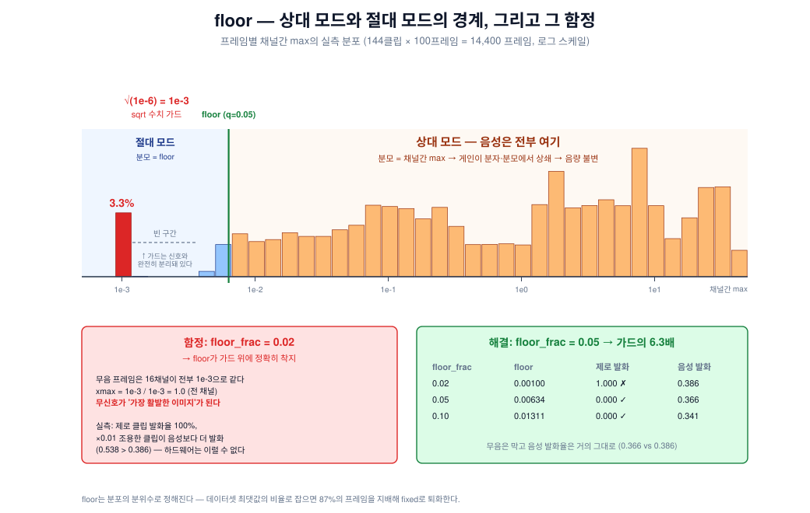

# xmax 정규화 — 채널간 상대 임계

`normalize: xmax` 와 그 `floor` 파라미터를 코드·회로·실측 세 방향에서 설명한다.
구현: [`../data/afe.py`](../data/afe.py) `AFEFrontend._xmax()`, `init_fixed_scale()`.
관련 문서: [`normalization.md`](normalization.md)(minmax), [`afe_circuit_explained.md`](afe_circuit_explained.md)(회로).

---

## 0. 한 줄 요약

> 각 채널을 **고정 전압**과 비교하는 대신, **바로 그 순간 16채널 중 최댓값**과 비교한다.
> 입력 음량이 분자·분모에서 상쇄되므로 **음량 불변성이 구조적으로 얻어진다** —
> 네트워크가 학습으로 극복해야 하는 것이 아니다.

$$V_{env,c} > \alpha_c \cdot \max\Big(\underbrace{\max_j V_{env,j}}_{\text{상대}},\ \underbrace{V_{floor}}_{\text{절대}}\Big)$$

---

## 1. 왜 이게 필요했나 — 문제의 배경

### 1-1. 음량은 우리가 지울 수 없는 유일한 잡음원

Cerutti의 min-max 정규화는 **클립 전체의 최댓값**으로 나눈다. 그런데 그 최댓값은
**1초가 다 지나야** 알 수 있다. 실시간 아날로그 회로는 미래를 볼 수 없으므로
**min-max는 하드웨어로 구현 불가능**하다. (자세한 내용은 [`normalization.md`](normalization.md))

그래서 실현 가능한 대안으로 `fixed`(고정 R7/R8 분압 = 절대 전압 임계)를 썼는데,
2×2 분해 실험에서 **정규화 비용이 −8pp** 로 필터 모양 비용(−4pp)의 **두 배**라는 게
드러났다.

| | minmax | fixed (q=0.75) | 정규화 비용 |
|---|---|---|---|
| mel 필터뱅크 | 0.846 | 0.761 | **−8.5pp** |
| spice 필터뱅크 | 0.802 | 0.726 | **−7.6pp** |
| 필터 모양 비용 | −4.4pp | −3.5pp | |

### 1-2. 증강으로는 안 됐다 (실패 기록)

"음량이 변해도 맞히도록 학습시키면 되지 않나?" → **±10 dB 게인 증강 결과 0.638** (−9pp).

원인은 명확하다. 고정 임계 아래에서 게인은 이진 이미지를 **교란(perturb)하는 게 아니라
지운다(erase)**:

- ×0.32 → 거의 전 채널이 임계 아래 → **전부 −1**
- ×3.2 → 거의 전 채널이 임계 위 → **포화**

지워진 이미지에서는 배울 게 없다. 증강은 **정보가 남아 있을 때만** 작동한다.

### 1-3. 음량을 지우는 방법은 수학적으로 셋뿐이다

우리 도메인에서 음량은 **곱셈**($x \to gx$)이다. 이걸 없애는 방법:

| # | 방법 | 우리 구현 | 하드웨어 대가 |
|---|---|---|---|
| (a) | 레벨 추정치로 **나눈다** | `agc` | VGA + **피드백 루프** |
| (b) | **log** 도메인에서 뺀다 | — | 감산 기준을 또 추정해야 함 |
| (c) | **채널끼리** 비교한다 | **`xmax`** ← 이 문서 | max 회로, **루프 없음** |

(c)가 유일하게 미시도였고 하드웨어가 가장 쌌다.

---

## 2. 원리


실측 프레임 하나(Speech Commands "yes", 프레임 49)에 입력 게인 ×1과 ×2를 준 결과다.

- **`fixed`**: 임계가 고정 → 입력이 2배가 되면 발화 채널이 **6개 → 9개**. 음량이 이미지에 샌다.
- **`xmax`**: 임계가 최댓값의 α배 → 임계도 함께 2배 → 발화 채널 **6개 → 6개**. **이미지 동일**.

### 2-1. 왜 정확히 상쇄되는가

입력에 게인 $g$가 걸리면 (선형 필터·정류이므로) 모든 채널 엔벨로프가 $g$배 된다:

$$\frac{g \cdot V_{env,c}}{\max_j (g \cdot V_{env,j})} = \frac{g \cdot V_{env,c}}{g \cdot \max_j V_{env,j}} = \frac{V_{env,c}}{\max_j V_{env,j}}$$

**$g$가 약분된다.** 학습도, 추정도, 시간 상수도 필요 없다.

### 2-2. 코드

```python
def _xmax(self, env: torch.Tensor) -> torch.Tensor:
    xmax = env.amax(dim=1, keepdim=True)                 # [B, 1, T]  채널축만 max
    return env / (torch.maximum(xmax, self.xmax_floor) + _EPS)
```

`dim=1`이 채널축이다. **시간축(dim=2)은 건드리지 않는다** — 이게 minmax와의 결정적 차이다.
minmax는 시간축까지 max를 취하기 때문에 미래를 봐야 하지만, xmax는 **그 프레임 안에서만**
계산하므로 **완전히 인과적(causal)** 이다.

### 2-3. 측정된 게인 불변성

이진 출력이 입력 게인에 대해 **몇 %나 동일하게 유지되는가**:

| 설정 | g=0.5 | g=2 | g=4 |
|---|---|---|---|
| `fixed` (기준) | 94.8% | 93.5% | 87.1% |
| `xmax` floor=0.30 | 96.0% | 96.2% | 93.6% |
| **`xmax` floor=0.10** | **98.3%** | **97.8%** | **96.8%** |
| `xmax` floor=0.02 | 99.4% | 99.6% | 99.5% |

---

## 3. α — 무엇이고 어떻게 정해지나

**α는 우리가 계속 학습해온 채널별 threshold 그 자체다.** 해석만 바뀌었다.

```python
env_norm = env / max(xmax, floor)      # _xmax()
binary   = sign(env_norm - threshold)  # forward()
```

정리하면 `env_c > threshold_c × max(...)` 이므로 **α_c = threshold_c**.

| 단계 | 방법 |
|---|---|
| **초기화** | 채널별 평균 엔벨로프 (`init_thresholds`, Cerutti IV-A) |
| **학습** | STE로 네트워크와 end-to-end |

### 3-1. α에 물리적 의미가 생긴다

$V_{env,c} \le \max_j V_{env,j}$ 이므로 정규화 결과가 항상 $[0,1]$ 이고, 따라서:

| α_c | 의미 |
|---|---|
| → 0 | 거의 항상 발화 |
| 0.3 ~ 0.6 | "그 순간 최대 대역의 30~60% 이상이면 발화" |
| → 1 | **가장 큰 채널만** 발화 (winner-take-all) |
| > 1 | 구조적으로 발화 불가 |

`fixed`에서는 threshold가 0.002~0.025 같은 **해석 불가능한 값**이었고 조건수 문제까지
일으켰다. 여기서는 **"최대의 몇 %"** 라는 읽을 수 있는 값이 된다.

---

## 4. floor — 두 모드의 경계



### 4-1. 왜 필요한가

floor가 없으면 무음에서 **"잡음 ÷ 잡음"** 이 된다. 16채널이 전부 잡음 수준이어도
그중 하나는 최댓값이므로 비율이 1에 가까워지고, **무음인데 발화**한다.

| 상황 | 분모 | 동작 |
|---|---|---|
| 소리 있음 (max > floor) | 채널간 max | **상대 모드** — 게인 불변 |
| 무음 (max < floor) | floor (상수) | **절대 모드** — 조용히 있음 |

### 4-2. 어떻게 정해지나

```python
xmax_floor = quantile(프레임별 채널간 max, xmax_floor_frac)
```

**프레임 분위수**다. `floor_frac=0.05` = "가장 조용한 5% 프레임만 절대 모드로".

> ⚠️ **처음에 여기서 실패했다.** floor를 *데이터셋 최댓값의 비율*로 잡았더니,
> 데이터셋 피크가 중앙값 프레임의 **약 200배**여서 floor가 **87%의 프레임을 지배**했다.
> `xmax`가 사실상 `fixed`로 퇴화해 게인 불변성이 측정되지 않았다.
> **프레임 분위수**로 바꿔 해결.

### 4-3. ⚠️ 두 번째 함정 — sqrt 수치 가드

엔벨로프는 `sqrt(mel + 1e-6)`로 계산되므로 ([afe.py](../data/afe.py) `envelopes()`)
**바닥이 정확히 `√(1e-6) = 1e-3`** 이다. 이건 신호가 아니라 **0으로 나누기를 막는 가드**다.

무음·제로패딩 프레임에서는 **16채널이 전부 이 값으로 똑같아진다.** 그러면:

$$\text{xmax} = \frac{10^{-3}}{10^{-3}} = 1.0 \quad \text{(전 채널)}$$

> **무신호가 "가장 활발한 이미지"로 변환된다.** 물리적으로 정반대이고, 실제 회로는
> 절대 이렇게 동작하지 않는다 (실제로는 열잡음에 의한 무작위 발화가 된다).

`floor_frac = 0.02`의 floor가 **정확히 이 가드 값(1.00e-3)** 이라 보호가 전혀 없었다:

| floor_frac | floor | 가드 대비 | 제로 클립 발화 | ×0.01 조용한 클립 | 정상 음성 |
|---|---|---|---|---|---|
| **0.02** | 0.00100 | **1.0×** | **1.000** ⚠️ | **0.538** ⚠️ | 0.386 |
| 0.05 | 0.00634 | 6.3× | 0.000 ✅ | 0.155 | 0.366 |
| 0.10 | 0.01311 | 13.1× | 0.000 ✅ | 0.123 | 0.341 |

`f=0.02`에서는 **조용한 클립이 정상 음성보다 더 많이 발화한다**(0.538 > 0.386).

영향 범위는 **전체 프레임의 3.3%** — 1초보다 짧은 클립의 제로패딩과 진짜 무음이다.
히스토그램에서 보이듯 **가드 스파이크와 실제 신호 사이에는 빈 구간이 있어서**,
floor를 그 사이(≈ 0.005)에 두면 깨끗하게 분리된다.

`init_fixed_scale()`에 이 상황을 잡는 경고가 들어 있고
(`tests/test_afe.py::test_xmax_warns_when_the_floor_lands_on_the_compression_guard`),
`clamp`가 아니라 `warn`인 이유는 기존 런의 숫자를 조용히 바꾸지 않기 위해서다.

---

## 5. 하드웨어 대응

### 5-1. α = 저항비

$$V_{thr,c} = \alpha_c V_{max} + (1-\alpha_c)\,V_{ref}$$

```
V_max ──[ Ra ]──┬──[ Rb ]── V_ref        α_c = Rb/(Ra+Rb)
                │
             V_thr,c
```

**부품 수는 현재와 동일**(채널당 저항 2개). `1.8V─R7─R8─GND` 가
`V_max─Ra─Rb─V_ref` 로 바뀔 뿐이다.

**뜻밖의 이득**: 지금 분압은 1.8 V 전체에 걸려 채널당 1.8 µA를 흘리지만(16채널 ≈ 52 µW),
새 분압은 `V_max`와 `V_ref`의 차이(~0.1 V)에만 걸린다 → **전류 약 18배 감소**,
52 µW → **~3 µW**.

### 5-2. `V_max`를 어떻게 만드나 — 정밀 max 회로가 필요하다

> ⚠️ **수동 다이오드-OR는 그대로 쓸 수 없다.** 다이오드 강하가 ~0.25 V인데
> v_env 스윙은 ~50 mV다. 강하가 10%만 변해도 25 mV가 이동해 마진(~20 mV)보다 크다.

해결책은 검출기에서 이미 쓴 것과 같은 트릭 — **다이오드를 op-amp 피드백 안에** 넣은
**정밀 max 회로**. 채널당이 아니라 **뱅크 전체에 1~2개**면 되므로 **+5~10 µW**.

| 항목 | 값 |
|---|---|
| 추가: 정밀 max 회로 | +5~10 µW |
| 절감: 분압 전류 | −49 µW |
| **순증** | **거의 0 또는 음수** |

AGC와 달리 **피드백 루프가 없어** 발진·어택/릴리즈·첫 단어 문제가 원천적으로 없다.

### 5-3. ⚠️ ML과 하드웨어의 형태 불일치 (미해결)

무음 근처에서 두 형태가 **α 의존성이 정반대**다:

| | 무음일 때 유효 임계 |
|---|---|
| **ML (현재)** | `α_c · floor` — α가 **클수록** 높음 |
| **하드웨어** | `(1−α_c) · δ` — α가 **작을수록** 높음 |

(δ ≡ V_ref − 검출기 정지점)

신호가 클 때는 둘 다 `α_c · S`로 같지만, 무음 근처에서 채널별로 어긋난다.
**R7/R8 매핑에서 우리를 물었던 것과 같은 종류의 함정**이므로, 하드웨어를 확정하기 전에
ML을 하드웨어 형태(선형 혼합)로 바꿔 재학습해야 한다.

---

## 6. 실측 결과

전부 spice 필터뱅크 + √ 압축 + 16채널, 동일 모델·동일 학습 설정.
정확도는 `comparator_vos = 0`(이상적 비교기) 기준이며, vos 스윕은 강건성 확인용이다.

| 정규화 | val | **test** | 하드웨어 | 피드백 루프 |
|---|---|---|---|---|
| `minmax` | — | 0.802 | ❌ 구현 불가 (미래를 봄) | — |
| `agc` + 캘리브레이션 | — | 0.789 | VGA | ⚠️ 있음 |
| **`xmax` floor=0.02** | 0.808 | **0.776** ⚠️ | 정밀 max | ✅ 없음 |
| `xmax` floor=0.10 | 0.795 | 0.756 | 정밀 max | ✅ 없음 |
| `fixed` q=0.75 | — | 0.726 | 없음 | — |

⚠️ **floor=0.02의 0.776은 §4-3의 퇴화에 일부 의존한다.** 문제 프레임이 3.3%뿐이라
대부분은 진짜일 것으로 보이나, **floor=0.05로 재확인이 필요**하다.

### 6-1. 오프셋 강건성 (floor=0.02)

| `comparator_vos` | test |
|---|---|
| 0.000 | 0.7758 |
| 0.001 | 0.7721 |
| 0.002 | 0.7740 |

평평하다 → **비교기 오프셋은 병목이 아니다.**

### 6-2. 덤: "silence" 클래스가 음성보다 3배 시끄럽다

| | RMS |
|---|---|
| 음성 (키워드 10종) | 0.0659 |
| **silence (배경잡음 크롭)** | **0.1925** |

`_background_noise_`가 풀스케일 녹음(설거지·수돗물·운동자전거)이기 때문이다. 그 결과:

| 정규화 | 무음 발화율 / 음성 발화율 |
|---|---|
| `fixed` | **5.19×** |
| `xmax` floor=0.10 | 1.93× |
| `xmax` floor=0.02 | 1.58× |

`fixed`에서는 네트워크가 **"얼마나 많이 켜졌나"라는 음량 단서만으로** silence를 골라낼 수
있었다. xmax는 그 단서를 걷어내고 패턴을 쓰게 만든다 — **그러고도 정확도가 올랐다**는 게
이 방향이 옳다는 근거다.

---

## 7. 설정 요약

```yaml
afe:
  filterbank_source: spice
  compression: sqrt          # xmax는 sqrt 필수 (log에서는 나눗셈이 의미 없음)
  normalize: xmax
  xmax_floor_frac: 0.05      # 프레임 분위수. sqrt 가드(1e-3) 위여야 함
```

- `init_fixed_scale(batch)` 를 **`init_thresholds(batch)` 보다 먼저** 호출해야 한다.
- `xmax_floor_frac <= 0` 이면 floor 없음 = 완전 상대 모드 (무음 보호 없음).
- `compression: log` 는 `ValueError`로 거부된다 — log 도메인에서 나누기는
  "지수의 비"라는 무의미한 연산이 되기 때문.

## 8. 남은 일

1. **`floor_frac=0.05` 재학습** — 신뢰할 수 있는 최종 숫자 확정
2. **하드웨어 정합 형태로 재학습** (§5-3) — `α·S + (1−α)·δ` 선형 혼합
3. δ를 실제 mV로 환산 → 동료에게 전달할 `V_ref` 설계값
4. SPICE 역검증 — 학습된 α를 실제 회로에 넣고 나온 이진 이미지로 재평가
