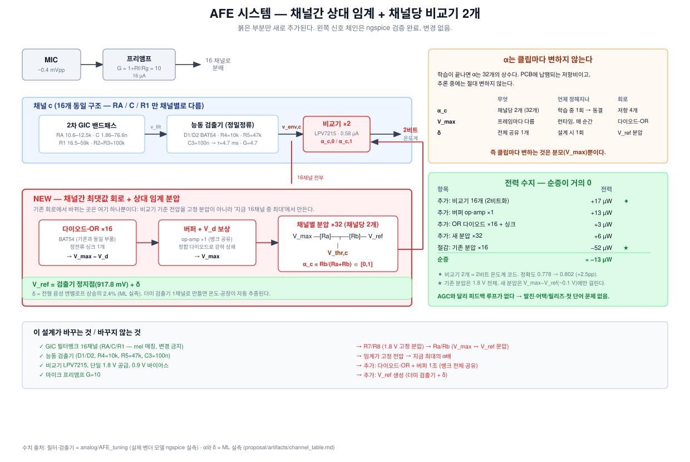

# 아날로그 설계

**이 문서가 회로 제작의 기준이다.** 모든 수치는 실제 벤더 모델(OPA379, BAT54WT1,
LPV7215)로 ngspice에서 직접 측정했거나, ML 실측에서 나왔다. 추정치는 그렇게 표시했다.

---

## 1. 어느 회로 버전인가 — 정확히

혼동하기 쉬운 부분이라 먼저 밝힌다. **ML이 쓰는 필터 응답과 동료의 v15 보드는 같은
회로다.** 방향은 동료 → 우리가 아니라 **우리 → 동료**다.

```
동료 KiCad 원본 (1채널)          우리 설계                      동료 v15
RA=2.32k C=10n R1=14.7k    →   ngspice .ac 로 RA/C/R1 스윕  →  channel_components.csv
토폴로지 + OPA379 모델          16채널 mel 등간격 배치            (= 우리 값 그대로)
```

| 항목 | 위치 |
|---|---|
| 우리 설계 (권위 있는 값) | [`analog/AFE/artifacts/filterbank_design.csv`](../analog/AFE/artifacts/filterbank_design.csv) |
| ML이 읽는 주파수 응답 행렬 | [`analog/AFE/artifacts/filterbank_matrix.csv`](../analog/AFE/artifacts/filterbank_matrix.csv) |
| 동료 보드 v15 | [`analog/ngspice_v15_2608001/`](../analog/ngspice_v15_2608001/) |
| 추출에 쓴 넷리스트 | [`analog/AFE/netlists/gic_channel.cir`](../analog/AFE/netlists/gic_channel.cir) |

**f_c, Q, RA, C, R1 — 16/16 채널 전부 일치**한다 (검증: [artifacts/channel_table.md](artifacts/channel_table.md)).
학습에 쓰는 필터 모양은 v15가 실제로 만드는 응답이다. **표류 없음.**

---

## 2. 시스템 구성



> 이전 회로도([`analog/AFE_final/artifacts/afe_final_system.svg`](../analog/AFE_final/artifacts/afe_final_system.svg))는
> **채널간 상대 임계 이전** 버전이다 (고정 R7/R8 + 선택적 AGC). 위 그림이 현재 안이다.

### 2-1. 바뀌지 않는 것 (검증 완료)

| 블록 | 값 | 근거 |
|---|---|---|
| 마이크 프리앰프 | G = 1 + Rf/Rg = 10 (Rf 90k / Rg 10k) | OPA379 GBW 92 kHz가 상한 |
| 2차 GIC 밴드패스 ×16 | RA 10.6–12.5k, C 1.86–76.6n, R1 16.5–59k, R2=R3=100k | `.ac` 실측, 이득 2.00 (공식과 일치) |
| 능동 검출기 ×16 | D1/D2 BAT54, R4=10k, R5=47k, R6=8.25k, C3=100n | G = R5/R4 = 4.7, τ = R5·C3 = 4.7 ms |
| 비교기 ×16 | LPV7215, 0.58 µA | |
| 공급 | 단일 1.8 V, 바이어스 0.9 V | |

> **R4=10k를 내리지 말 것** — 프리앰프와 이득 예산을 공유한다.
> **RA/C/R1을 바꾸지 말 것** — mel 매칭 f_c/Q가 깨진다.

### 2-2. 새로 추가할 것

기존 회로에서 바뀌는 곳은 **비교기 기준 전압을 만드는 방법 하나뿐**이다.

```
        기존                              새로
1.8V ─[R7]─┬─[R8]─ GND          V_max ─[Ra]─┬─[Rb]─ V_ref
           │                                 │
        V_thr,c  (고정)                   V_thr,c  (지금 최대의 α배)
```

| 블록 | 부품 | 기능 |
|---|---|---|
| 다이오드-OR | BAT54 ×16 + 정전류 싱크 ×1 | $V_{max} - V_d$ 생성 |
| 버퍼 + $V_d$ 보상 | op-amp ×1, 정합 다이오드 ×1 | 강하 상쇄 + 16개 분압 구동 |
| 채널별 분압 | 저항 ×32 (기존과 동일 개수) | $\alpha_c = R_b/(R_a+R_b)$ |
| $V_{ref}$ 생성 | 더미 검출기 1채널 + 오프셋 | 정지점 + δ |

---

## 3. 설계 상세

### 3-1. 왜 수동 다이오드-OR만으로는 안 되나

다이오드 강하가 **~0.25 V**인데 v_env 스윙은 **~50 mV**다. 강하가 온도로 10%만 변해도
25 mV가 이동해 마진(~20 mV)보다 크다.

**해법**: 검출기에서 이미 쓴 것과 같은 트릭 — **정합 다이오드로 강하를 상쇄**한다.
BAT54는 이미 듀얼 패키지(BAT54WT1)를 쓰고 있으므로, 같은 다이 위의 짝을 기준 경로에
넣으면 온도 드리프트가 대부분 지워진다.

**버퍼가 필요한 이유**: OR 노드가 16개 분압을 구동해야 하는데, 저전류 영역의 다이오드
동저항이 높다. op-amp 볼티지 팔로워 1개(뱅크 전체 공유)로 해결한다.

### 3-2. V_ref 와 δ

$$V_{ref} = V_{\text{검출기 정지점}} + \delta$$

정지점은 실측 **917.8 mV**다 (동료 측정 917.83 mV와 0.55 mV 이내 일치).

**δ를 얼마로?** ML이 준 값은 절대 전압이 아니라 **비율**이다 — 마이크 감도·프리앰프
이득과 무관하게 적용할 수 있다:

| `xmax_floor_frac` | δ / 전형 음성 엔벨로프 상승 | 발화 프레임 비율 |
|---|---|---|
| 0.02 | 0.4% | 98% |
| **0.05 (권장)** | **2.4%** | **93.3%** |
| 0.10 | 3.9% | 90% |

**실제 설정 방법**: 보드에서 전형적인 음성을 넣고 v_env의 **정지점 위 상승**을
프레임별로 재어 중앙값을 구한 뒤, `V_ref = 917.8 mV + 0.024 × (그 중앙값)`.

> ⚠️ **주의**: δ는 작다. 전형 상승이 20 mV면 δ ≈ 0.5 mV로, **비교기 오프셋(수 mV)보다
> 작다.** 즉 실제 보드의 무음 동작은 δ가 아니라 오프셋이 지배할 수 있다.
> **더미 검출기로 V_ref를 만들면** 정지점을 자동 추종하므로 이 문제가 크게 완화된다
> (같은 온도·공정·전원 변동을 함께 겪는다).

### 3-3. α → 저항값

$$\alpha_c = \frac{R_b}{R_a + R_b}$$

$R_a + R_b$는 자유도다. 크게 잡을수록 전력이 준다. **권장 $R_a + R_b = 1\ \text{M}\Omega$**:

- 분압에 걸리는 전압은 $V_{max} - V_{ref}$ (~0.1 V)뿐이므로 채널당 **0.1 µA**
- 기존 분압은 1.8 V 전체에 걸려 채널당 **1.8 µA**였다 → **18배 감소**

채널별 α 값은 [artifacts/channel_table.md](artifacts/channel_table.md)에 있다.
학습이 끝난 뒤 [REPRODUCE.md](REPRODUCE.md)의 추출 셀로 최종값을 뽑는다.

### 3-4. 전력 수지

| 항목 | 전력 |
|---|---|
| 추가: 버퍼 op-amp ×1 | +13 µW |
| 추가: OR 다이오드 ×16 + 정전류 싱크 | +3 µW |
| 절감: 채널별 분압 (52 → 3 µW) | **−49 µW** |
| **순증** | **≈ −33 µW** |

**AGC 대비의 진짜 이득은 전력이 아니라 리스크다.** 피드백 루프가 없으므로 발진,
어택/릴리즈 튜닝, 첫 단어 문제가 원천적으로 없다.

---

## 4. 확정된 실측값

| 항목 | 값 | 출처 |
|---|---|---|
| GIC 통과대역 이득 | **2.00** (6 dB) | `.ac`, 공식과 일치 |
| 검출기 이득 G = R5/R4 | 4.7 | 회로 |
| 엔벨로프 시상수 τ = R5·C3 | 4.7 ms (실측 4.62) | |
| 검출기 정지점 v_env | **917.8 mV** | `.tran` |
| DC 전달곡선 기울기 / 바닥 | **−4.70 / 894.4 mV** | `.dc` |
| 채널 스윙(정지점 위 상승) | 28–65 mV (거의 균일) | `.tran` |
| op-amp GBW | OPA379 92 kHz / TLV9042 328 kHz / TLV9041D 1.72 MHz | 벤더 모델 |

> ⚠️ 초기 채널별 "스윙" 수치는 **정상상태 리플**을 잰 것이라 틀렸다(86→1.2 mV,
> ch14/15 사용불가 결론). 비교기가 검출하는 것은 **정지점 위로의 상승**이고 그건 거의
> 균일하다. `analog/AFE_tuning/artifacts/v15_circuit_review.md` §3-3에 오류 표시가 있다.

---

## 5. 시뮬 충실도 — 무엇이 맞고 무엇이 아직 모르는가

ML이 쓰는 것은 `.ac`로 뽑은 **필터 주파수 응답**이다. 검출기와 비교기는 비선형이라
`.ac`에 들어갈 수 없다. 그럼 검출기는 어떻게 모델했나?

### √ 압축은 검출기의 실제 동작이다 (검증됨)

실측 DC 전달곡선에서 검출기는 895 mV 아래에서 **기울기 −4.70의 선형**이다. C3가 피크를
잡으므로:

$$v_{env} - v_{\text{정지점}} = 4.70 \times A \qquad (A = v_{filt}\text{의 진폭})$$

$A \propto \sqrt{\text{power}}$ 이므로 **√ 압축이 정확히 맞다.** 검산:

| | 값 |
|---|---|
| 입력 10 mVpp → 필터 이득 2배 → 진폭 A | 10 mV |
| **예측** 스윙 = 4.70 × 10 mV | **47.0 mV** |
| **실측** 스윙 | **48.0 mV** ✅ |

### 남은 불일치 2가지

| 요소 | 모델 | 영향 |
|---|---|---|
| **C3 평활 τ = 4.7 ms** | 없음 (`envelope_tau_ms = 0`) | 뒤따르는 10 ms max-pool이 이미 강한 평활이고 τ < window라 효과가 작을 것으로 **추정** |
| **검출기 포화** (v_filt > 895 mV) | 없음 | $v_{filt}$ 스윙이 5 mV를 넘어야 시작. 실제 마이크(0.4 mV × 2 = 0.8 mV)에서는 미도달 |

τ를 baseline에 넣지 않은 것은 **의도적**이다 (CLAUDE.md 3.2): 논문에 값이 없어 임의값이
되고, 그러면 정확도 미달 시 원인 분리가 불가능해진다.

### 결정적 시험: `.tran` 역검증

위 두 항목이 실제로 작은지는 **추정**이다. 확실히 하려면:

1. 학습된 α를 실제 회로에 넣는다
2. 일부 클립에 대해 실제 과도해석(`.tran`)을 돌려 이진 이미지를 뽑는다
3. 그 이미지를 학습된 네트워크에 넣어 정확도를 잰다

시뮬 정확도와 비슷하면 충실도가 확인되고, 크게 떨어지면 τ나 포화를 모델에 넣어야 한다.
**아직 안 했고, 남은 유일한 미지수다.**

다만 이 문서의 목적은 **큰 틀의 설계 확정**이므로, τ 같은 세부는 실제 AFE를 만들어
그 출력으로 재학습할 때 자연히 해결된다 — 그때는 시뮬이 아니라 실물이 진리가 된다.
