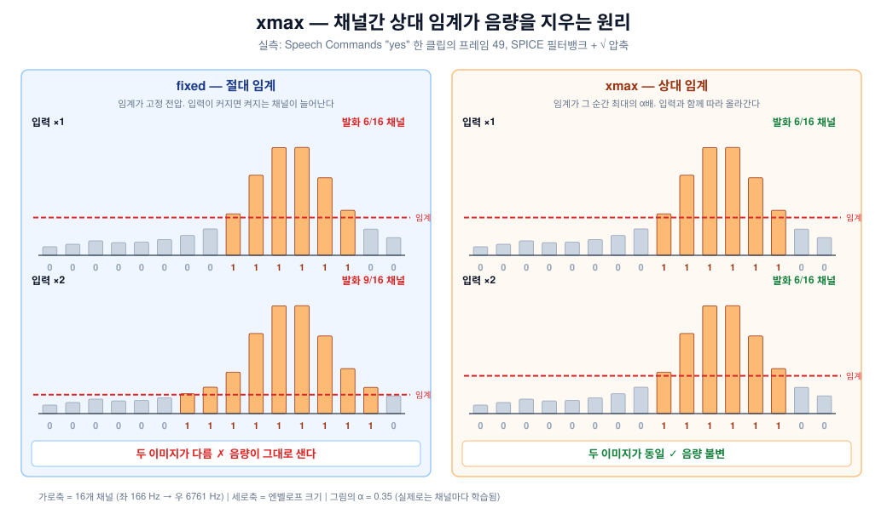

# 원리 — 왜 채널간 상대 임계인가

수식을 최소한으로 쓰되, 각 식이 회로의 무엇에 대응하는지 매번 밝힌다.

---

## 1. 문제: 음량은 곱셈이다

마이크 앞에서 두 배 크게 말하면 **모든 채널이 똑같이 두 배**가 된다.

$$V_c \;\longrightarrow\; g \cdot V_c \qquad (\text{모든 } c\text{에 대해 같은 } g)$$

$g$는 화자·거리·마이크 감도가 정하는 값이고, 우리가 통제할 수 없다.

고정 전압 임계 $\theta$는 이걸 못 견딘다:

$$g V_c > \theta$$

$g$가 커지면 전부 켜지고, 작아지면 전부 꺼진다. **이미지가 교란되는 게 아니라 지워진다.**

> **증강으로는 안 됐다** (실측): ±10 dB 게인 증강 → 0.638 (−9pp).
> 증강은 정보가 남아 있을 때만 통한다. ×0.32면 거의 전 채널이 −1, ×3.2면 포화라
> 배울 게 남지 않는다.

## 2. 해법의 유일한 형태

$g$를 없애려면 **같은 $g$가 걸린 두 양의 비**를 취하는 수밖에 없다. 무엇으로 나눌지가
설계 선택의 전부다.

| 나눌 대상 | 이름 | 회로에서 |
|---|---|---|
| 클립 전체의 최대 | `minmax` | ❌ **미래를 봐야 한다** — 1초가 끝나야 알 수 있음 |
| 시간 평균 추정치 | `agc` | ⚠️ VGA + **피드백 루프** (발진·어택/릴리즈·첫 단어) |
| **그 순간 다른 채널들의 최대** | **`xmax`** | ✅ 지금·여기서 계산 가능, 루프 없음 |

## 3. xmax — $g$가 약분된다

$$\frac{g V_c}{\displaystyle\max_j\,(g V_j)} \;=\; \frac{\cancel{g}\, V_c}{\cancel{g} \displaystyle\max_j V_j} \;=\; \frac{V_c}{\displaystyle\max_j V_j}$$

**$g$가 완전히 사라진다.** 학습도, 추정도, 시간상수도 필요 없다 — 불변성이 **구조적**이다.



실측 프레임 하나에 ×1과 ×2를 넣은 결과다. `fixed`는 발화 채널이 6→9개로 늘고,
`xmax`는 6→6개로 **이미지가 그대로**다.

**측정된 게인 불변성** (입력 게인을 줬을 때 이진 출력이 동일한 비율):

| | g=0.5 | g=2 | g=4 |
|---|---|---|---|
| `fixed` | 94.8% | 93.5% | 87.1% |
| **`xmax`** | **98.3%** | **97.8%** | **96.8%** |

## 4. floor — 무음을 막는 바닥

무음일 때는 16채널이 전부 잡음뿐이다. 그래도 그중 하나는 최대이므로:

$$\frac{\text{잡음}}{\text{잡음}} \approx 1 \;>\; \alpha \quad\Longrightarrow\quad \textbf{무음인데 발화}$$

그래서 분모에 바닥 $\delta$를 깐다:

$$V_c \;>\; \alpha_c \cdot \max\Big(\underbrace{\textstyle\max_j V_j}_{\text{소리 있을 때}},\; \underbrace{\delta}_{\text{무음일 때}}\Big)$$

- **소리 큼** ($\max_j V_j > \delta$) → 분모가 신호를 따라간다 → **상대 모드, 음량 불변**
- **무음** ($\max_j V_j < \delta$) → 분모가 상수 → **절대 모드, 조용히 있음**


**설정 방법**: `xmax_floor_frac`은 $\delta$를 직접 주지 않는다. **"가장 조용한 몇 %의
프레임을 무음으로 볼 것인가"** 를 준다. 0.05면 하위 5% 프레임의 값이 $\delta$가 된다.

> ⚠️ 여기서 두 번 넘어졌다. 자세한 내용은 [EXPERIMENTS.md](EXPERIMENTS.md) §함정.

## 5. α — 저항비이자 학습 파라미터

$$\alpha_c = \frac{R_b}{R_a + R_b} \;\in\; [0, 1]$$

$V_c \le \max_j V_j$ 이므로 정규화값이 항상 $\le 1$이고, 따라서 α가 [0,1]을 벗어나면
의미가 없다 — **저항비의 물리적 범위와 정확히 일치한다.**

| α | 의미 |
|---|---|
| → 0 | 거의 항상 발화 |
| 0.2 | "지금 최대의 20%만 넘으면 켠다" — 예민 |
| 0.6 | "60%는 넘어야 켠다" — 둔감 |
| → 1 | 가장 큰 채널만 (winner-take-all) |

`fixed`에서 threshold는 0.002~0.025 같은 **해석 불가능한 값**이었고 조건수 문제까지
일으켰다. 여기서는 **"최대의 몇 %"** 라는 읽을 수 있는 값이다.

### α는 클립마다 변하지 않는다

이 구분이 가장 중요하다.

| | 무엇 | 언제 정해지나 | 회로 |
|---|---|---|---|
| **α_c** | 채널당 1개, **총 16개** | 학습 중 한 번 → **동결** | 저항 2개 (고정) |
| **V_max** | **프레임마다 다름** | 런타임, 매 순간 | 다이오드-OR |
| **δ** | 전체 공유 1개 | 설계 시 한 번 | V_ref 분압 |

**클립마다 변하는 것은 분모(V_max)뿐**이고, 그건 회로가 실시간으로 만든다.
α는 PCB에 납땜되는 상수다.

## 6. xmix — 회로는 max를 못 만든다

저항 분압기는 두 전압을 **선형으로 섞을 수만** 있다. max가 아니라 가중평균이다:

$$V_{thr,c} = \alpha_c V_{max} + (1-\alpha_c) V_{ref}$$

α=1이면 $V_{max}$, α=0이면 $V_{ref}$, 그 사이는 섞인다. 정리하면:

$$V_c > \alpha_c S + (1-\alpha_c)\delta \quad\Longleftrightarrow\quad \boxed{\;\frac{V_c - \delta}{S - \delta} > \alpha_c\;}$$

($S \equiv \max_j V_j$, $\delta \equiv V_{ref} - \text{정지점}$)

**분모에서 δ를 빼는 대신 분자에서도 뺀다** — δ를 "새로운 0"으로 삼아 다시 재는 것이다.
여전히 **"정규화값 > 상수 α"** 형태라 코드 구조가 그대로다.

### 왜 굳이 형태를 맞추나

두 형태는 신호가 클 때($S \gg \delta$) 같은 값을 준다. 하지만 **무음 근처에서 α 의존성이
정반대**다:

| | 무음일 때 유효 임계 |
|---|---|
| `xmax` | $\alpha_c \cdot \delta$ — α가 **클수록** 높음 |
| **회로 (`xmix`)** | $(1-\alpha_c) \cdot \delta$ — α가 **작을수록** 높음 |

**실측: 동일 α에서 두 형태가 이진 비트의 10%에서 갈린다.** `xmax`로 학습한 α를 그대로
납땜하면 채널별로 어긋난다. R7/R8 매핑에서 우리를 물었던 것과 **같은 종류의 함정**이라,
하드웨어를 확정하기 전에 잡았다.

### 부수 효과: 수치 함정에 면역

`xmax`는 무음에서 (수치 가드)/(수치 가드) = 1이 되어 **전 채널 발화**할 수 있었다.
`xmix`는 나누는 대신 **빼기** 때문에 분자가 음수가 되어 구조적으로 꺼진다.

---

## 7. 소프트웨어는 회로를 어떻게 계산하는가

**흉내내는 게 아니라 같은 연산을 그대로 한다.**

| 회로가 하는 일 | 우리 코드 ([`data/afe.py`](../data/afe.py)) |
|---|---|
| 16개 엔벨로프 → 정밀 max → $V_{max}$ | `s = env.amax(dim=1, keepdim=True)` |
| 분압 $\alpha V_{max} + (1-\alpha)V_{ref}$ | `(env - d) / (s - d)` 로 재배열 |
| 비교기 | `sign_ste(정규화값 − α)` |

```python
def _xmix(self, env):
    s = env.amax(dim=1, keepdim=True)      # 다이오드-OR
    d = self.xmax_floor                    # V_ref - 정지점
    out = torch.where(s > d, (env - d) / (s - d).clamp_min(_EPS),
                      torch.full_like(env, -1.0))
    return out.clamp(-1.0, 1.0)
```

### 결정적인 점: 시간축을 건드리지 않는다

`dim=1`은 **채널축**이다. 각 프레임은 **자기 프레임 안의 16개 값만** 본다.

- 미래를 보지 않으므로 **완전히 인과적**이다 → 회로가 매 순간 하는 일과 같다
- `minmax`는 `dim=(1,2)`로 시간축까지 뭉개서 미래를 봤고, **그래서 하드웨어로 불가능**했다

근사가 들어가는 곳은 이 연산이 아니라 **그 앞단(필터·검출기)** 이다 —
[ANALOG.md](ANALOG.md) §충실도 참고.

### `clamp(-1, 1)`이 정보를 버리지 않는 이유

비교기는 **기준보다 아래면 얼마나 아래인지 출력하지 못한다.** "조금 아래"와 "한참
아래"가 둘 다 0이다. 따라서 음수 꼬리를 자르는 것은 회로가 이미 버리는 정보를 버리는
것이고, 대신 α가 [0,1] 안에 자연스럽게 들어온다.

(자르지 않으면 $S$가 $\delta$보다 아주 조금 클 때 몫이 −59까지 가고, 값의 89%가 음수가
되어 채널 평균 초기화가 α = −15로 간다. 어떤 저항 쌍으로도 만들 수 없는 값이다.)
