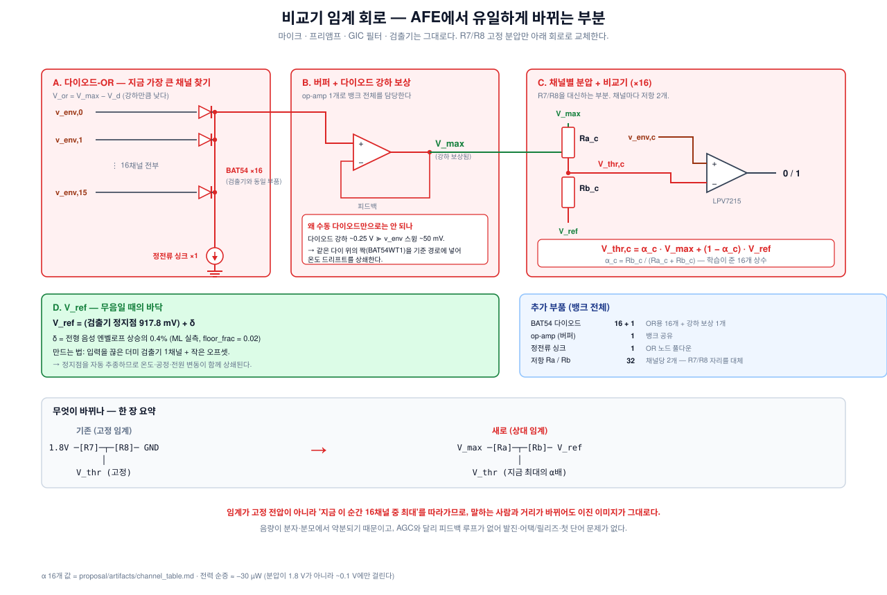

# 임계 회로 — 확정 설계

**AFE에서 바뀌는 부분은 이것 하나뿐이다.** 마이크·프리앰프·GIC 필터·검출기는 이미
검증됐고 그대로 쓴다. 비교기의 기준 전압을 만드는 방법만 교체한다.

---

## 1. 한 장 요약

```
        기존 (고정 임계)                      확정안 (상대 임계)

  1.8V ──[R7]──┬──[R8]── GND        V_max ──[Ra_c]──┬──[Rb_c]── V_ref
               │                                    │
            V_thr  (항상 같은 값)               V_thr,c  (지금 최대의 α배)
```

$$\boxed{\;V_{thr,c} \;=\; \alpha_c\,V_{max} \;+\; (1-\alpha_c)\,V_{ref}\;}
\qquad \alpha_c=\frac{R_{b,c}}{R_{a,c}+R_{b,c}}$$

**바뀐 것은 분압의 양 끝단뿐이다.** `1.8V ↔ GND` 였던 것이 `V_max ↔ V_ref`가 된다.
저항 개수도, 채널당 배선 수도 그대로다.



---

## 2. 왜 이렇게 하나

고정 임계는 **음량을 못 견딘다.** 같은 "yes"라도 사람과 거리에 따라 신호가 몇 배씩
달라지는데, 임계가 고정이면:

- 작게 말하면 → 거의 모든 채널이 임계 아래 → **이미지가 텅 빔**
- 크게 말하면 → 거의 모든 채널이 임계 위 → **이미지가 꽉 참**

**교란되는 게 아니라 지워진다.** 실측으로 정확도를 **8pp** 깎아먹었고, 게인 증강으로
학습시켜 봤지만 오히려 −9pp였다(지워진 이미지에서는 배울 게 없다).

**해법**: 각 채널을 고정 전압이 아니라 **바로 그 순간 16채널 중 최댓값**과 비교한다.
입력이 $g$배 되면 분자도 분모도 $g$배가 되어 **약분된다**:

$$\frac{g\,V_c}{g\,V_{max}} = \frac{V_c}{V_{max}}$$

음량 불변성이 **구조적으로** 얻어진다 — 네트워크가 학습으로 극복하는 게 아니다.

> **AGC와의 차이**: AGC도 음량을 지우지만 **피드백 루프**가 필요하다(레벨을 추정해서
> 이득을 되돌린다). 그러면 발진, 어택/릴리즈 튜닝, 첫 단어를 놓치는 문제가 따라온다.
> 이 회로는 **루프가 없다** — 매 순간 지금 값만 본다.

---

## 3. 블록별 설명

### A. 다이오드-OR — "지금 가장 큰 채널" 찾기

16개 검출기 출력에 다이오드를 하나씩 붙이고 캐소드를 묶는다. 가장 높은 전압을 가진
채널의 다이오드만 도통하므로, 공통 노드가 **최댓값**을 따라간다.

```
v_env,0  ──|>|──┐
v_env,1  ──|>|──┤
   ⋮            ├── V_or = V_max − V_d
v_env,15 ──|>|──┤
                │
               [정전류 싱크]
                │
               GND
```

부품: **BAT54 ×16** — 검출기에서 이미 쓰는 것과 같은 다이오드다.

### B. 버퍼 + 다이오드 강하 보상

수동 다이오드-OR만으로는 **못 쓴다**:

| | 값 |
|---|---|
| 다이오드 순방향 강하 | **~0.25 V** |
| v_env 스윙 | **~50 mV** |

강하가 온도로 10%만 변해도 **25 mV**가 이동하는데, 이건 우리 마진(~20 mV)보다 크다.

**해법**: 검출기에서 이미 쓴 것과 같은 트릭 — 같은 다이 위의 짝(BAT54WT1은 듀얼
패키지)을 기준 경로에 넣어 **강하를 상쇄**한다. 온도가 변해도 둘이 같이 변하므로
차이는 그대로다.

**버퍼가 필요한 이유**: OR 노드가 16개 분압을 구동해야 하는데, 저전류 영역에서
다이오드 동저항이 높다. **op-amp 볼티지 팔로워 1개**(뱅크 전체 공유)로 해결한다.

### C. 채널별 분압 — R7/R8을 대체하는 부분

$V_{max}$와 $V_{ref}$ 사이에 저항 2개. 탭이 그 채널의 임계다.

$R_a + R_b$는 자유도이고 **클수록 전력이 준다. 권장 1 MΩ**:

| | 걸리는 전압 | 채널당 전류 |
|---|---|---|
| 기존 R7/R8 | **1.8 V 전체** | 1.8 µA |
| **새 Ra/Rb** | $V_{max}-V_{ref}$ ≈ **0.1 V** | **0.1 µA** |

**18배 감소**한다. 이게 아래 전력 수지가 음수인 이유다.

### D. V_ref — 무음일 때의 바닥

$$V_{ref} = \underbrace{917.8\ \text{mV}}_{\text{검출기 정지점 (실측)}} + \;\delta$$

**왜 필요한가**: 무음일 때는 16채널이 전부 잡음뿐이다. 그래도 그중 하나는 최댓값이라
비율이 1에 가까워지고, **무음인데 발화**한다. $V_{ref}$를 정지점보다 δ만큼 올려두면
그 아래는 절대 임계로 동작해 조용히 있는다.

**δ 값**: ML이 준 것은 절대 전압이 아니라 **비율**이다 — 마이크 감도·프리앰프 이득과
무관하게 적용할 수 있다.

$$\delta = 0.004 \times (\text{전형 음성 엔벨로프 상승의 중앙값})$$

**실제 설정 방법**: 보드에 전형적인 음성을 넣고 v_env의 *정지점 위 상승*을 프레임별로
재어 중앙값을 구한 뒤, 그 값의 0.4%를 917.8 mV에 더한다.

> **만드는 법 권장**: 입력을 끊은 **더미 검출기 1채널** + 작은 오프셋. 정지점을 자동
> 추종하므로 온도·공정·전원 변동이 함께 상쇄된다. δ가 작아(전형 상승이 20 mV면
> δ ≈ 0.1 mV) 절대 전압으로 만들면 비교기 오프셋에 묻히기 때문에, **추종형이 안전하다.**

---

## 4. α — 16개의 상수

**α는 클립마다 변하지 않는다.** 학습이 끝나면 **16개의 숫자**이고, 저항비로 납땜된다.

| | 무엇 | 언제 정해지나 | 회로에서 |
|---|---|---|---|
| **α_c** | 채널당 1개, **총 16개** | 학습 중 한 번 → **동결** | 저항 2개 (고정) |
| **V_max** | **프레임마다 다름** | 런타임, 매 순간 | 다이오드-OR |
| **δ** | 전체 공유 1개 | 설계 시 한 번 | V_ref 오프셋 |

> **클립마다 변하는 것은 분모($V_{max}$)뿐**이고, 그건 회로가 실시간으로 만든다.

**α의 의미**: "그 순간 최대 대역의 몇 %를 넘으면 켜는가"

| α | 뜻 |
|---|---|
| 0.2 | 최대의 20%만 넘으면 켠다 — 예민 |
| 0.6 | 60%는 넘어야 켠다 — 둔감 |
| 1.0 | 가장 큰 채널만 (= 사실상 죽은 채널) |

$V_c \le V_{max}$ 이므로 **α는 항상 [0,1]** 이고, 이는 저항비 $R_b/(R_a+R_b)$의 물리적
범위와 정확히 일치한다.

**채널별 값**: [`artifacts/channel_table.md`](artifacts/channel_table.md)
**추출 방법**: [`REPRODUCE.md`](REPRODUCE.md) §α 추출 — 반드시 `afe.effective_alpha()`로 읽을 것

---

## 5. 부품과 전력

### 추가 부품 (뱅크 전체)

| 부품 | 개수 | 용도 |
|---|---:|---|
| BAT54 다이오드 | **16 + 1** | OR용 16개 + 강하 보상 1개 |
| op-amp (버퍼) | **1** | 뱅크 공유 |
| 정전류 싱크 | **1** | OR 노드 풀다운 |
| 저항 Ra / Rb | **32** | 채널당 2개 — **R7/R8 자리를 그대로 대체** |

### 전력 수지 — 순증이 **음수**다

| 항목 | 전력 |
|---|---:|
| 추가: 버퍼 op-amp ×1 | +13 µW |
| 추가: OR 다이오드 + 정전류 싱크 | +3 µW |
| 추가: 새 분압 ×16 (0.1 V 구간) | +3 µW |
| 절감: 기존 분압 ×16 (1.8 V 전체) | **−52 µW** |
| **순증** | **≈ −33 µW** |

**임계를 똑똑하게 만들면서 전력은 오히려 준다.**

---

## 6. 정확도

| 구성 | test | 비고 |
|---|---:|---|
| 고정 임계 (`fixed`) | 0.726 | 지금 v15 보드 방식 |
| **상대 임계 (확정안)** | **0.778** | **+5.2pp** |
| 참고: `max()` 회로를 추가한 이상적 형태 | 0.781 | +0.35pp뿐 → **분압으로 충분** |
| 참고: AGC (피드백 루프) | 0.789 | +1.1pp에 루프 리스크 → 폐기 |
| 참고: 구현 불가능한 이론 상한 | 0.802 | 클립 전체 max = 미래를 봐야 함 |

**분압만으로 이론 상한의 97%에 도달한다.** `max()` 회로를 추가해 봐야 0.35pp뿐이라
**추가 회로 없이 저항 분압으로 확정**한다.

---

## 7. 업그레이드 경로 — 채널당 비교기 2개

지금은 **채널당 비교기 1개**로 확정했지만, **2개로 늘리면 +2.5pp**이고 측정을 마쳤다.

| | 비교기 | test | 비교기 전력 | 총 전력 순증 |
|---|---:|---:|---|---:|
| **확정안** | 16개 | **0.778** | 16.7 µW | −33 µW |
| 업그레이드 | 32개 | **0.802** | 33.4 µW | **−13 µW** (여전히 음수) |

같은 엔벨로프를 **두 개의 분압으로 나눠 두 비교기가 보면** 채널당 2비트가 된다.
회로 변경은 채널마다 분압 1쌍 + 비교기 1개 추가가 전부다.

> **비교기를 2배로 늘려도 총 전력은 여전히 줄어든다.** 분압 절감분이 더 크기 때문이다.
> 부품 수·기판 면적이 문제가 아니라면 **2개 쪽이 낫다.**

3개(3비트)는 +0.8pp에 그쳐 수확 체감이고, 48개 중 ~10%가 놀기 시작한다 —
자세한 내용은 [`EXPERIMENTS.md`](EXPERIMENTS.md) §8.

---

## 8. 제작 체크리스트

- [ ] `V_ref`는 **더미 검출기 추종형**으로 만든다 (절대 전압으로 만들지 말 것)
- [ ] OR 다이오드는 검출기와 **같은 BAT54**를 쓰고, 강하 보상용 짝은 **같은 패키지**에서 뽑는다
- [ ] $R_a + R_b = 1\ \text{M}\Omega$ (전력). 채널별 비는 [`channel_table.md`](artifacts/channel_table.md)
- [ ] 버퍼 op-amp는 16개 분압(총 ~1.6 µA)을 구동할 수 있어야 한다
- [ ] **RA / C / R1 은 건드리지 말 것** — mel 매칭 f_c/Q가 깨진다
- [ ] **R4 = 10 kΩ 을 내리지 말 것** — 프리앰프와 이득 예산을 공유한다
- [ ] 보드가 나오면 v_env 정지점을 실측해 **δ를 재계산**한다 (설계값 917.8 mV)
